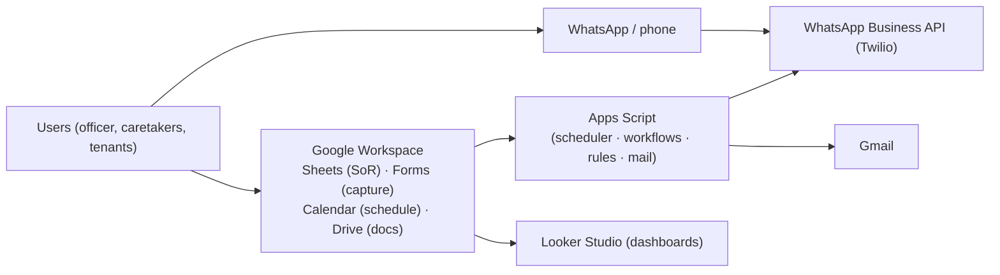
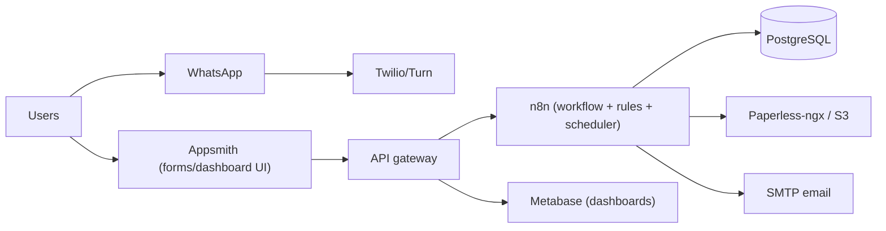
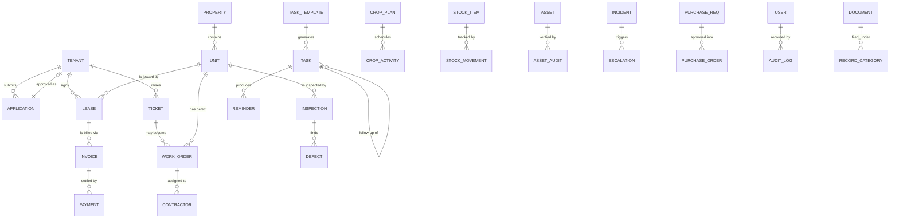
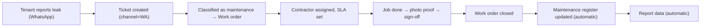
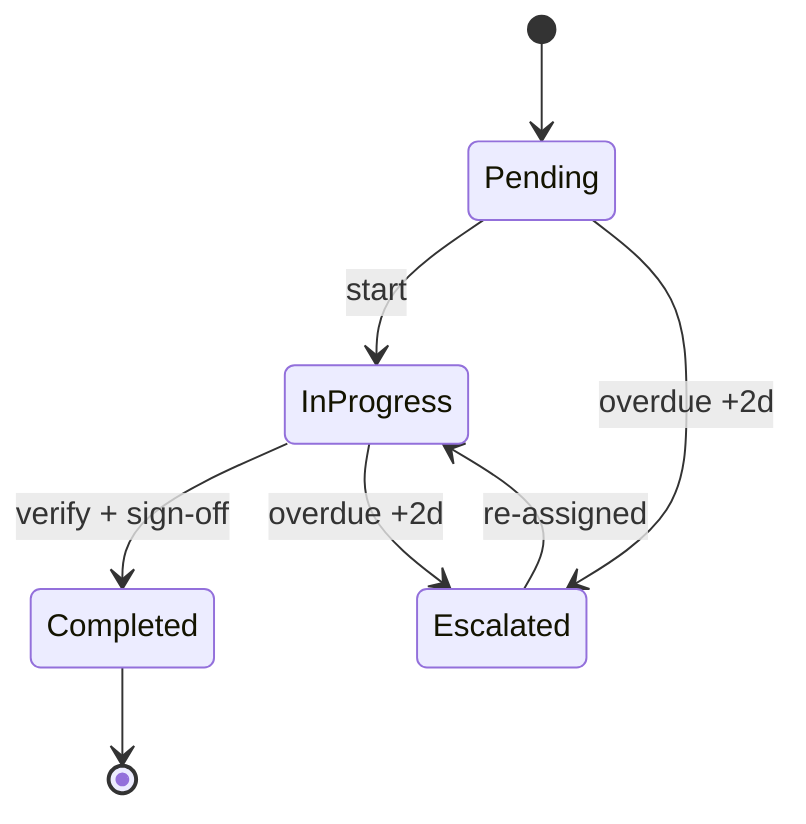
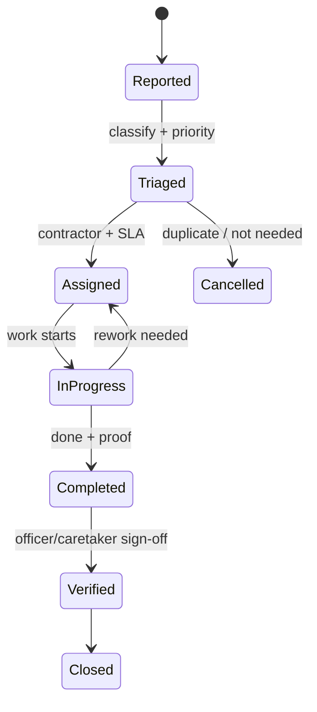
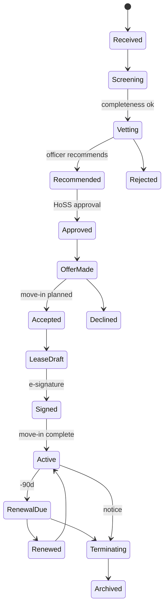
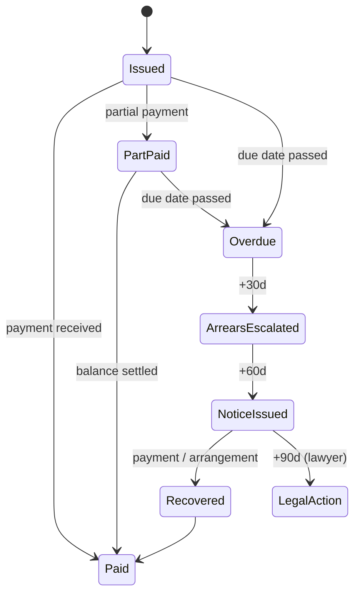
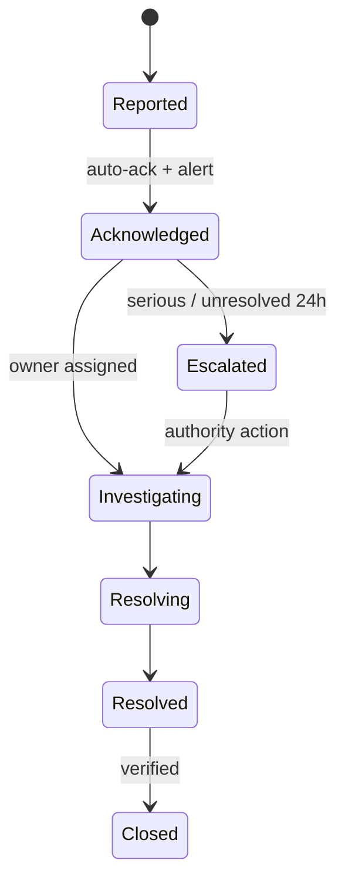

# Full Architecture
## Automation of the Administrative Officer (Farm & Property Management)

| | |
| --- | --- |
| **Document** | Full Architecture (pre-code) |
| **Status** | Draft for review & approval |
| **Version** | 1.0 |
| **Prepared for** | Head of Support Services / Management |
| **Source documents** | `Administrative_Officer_Farm_Property_Coordination_Workplan.pdf` · `Administrative_Officer_Job_Description-1.pdf` |
| **Related** | [`activity-inventory.md`](activity-inventory.md) — requirements & automation traceability matrix |

---

## Table of contents

1. [Executive summary](#1-executive-summary)
2. [Business context](#2-business-context)
3. [Objectives & success criteria](#3-objectives--success-criteria)
4. [Scope & boundaries](#4-scope--boundaries)
5. [Stakeholders & concerns](#5-stakeholders--concerns)
6. [Current state (as-is) & pain points](#6-current-state-as-is--pain-points)
7. [Requirements](#7-requirements)
8. [Architecture principles](#8-architecture-principles)
9. [Target architecture — logical view](#9-target-architecture--logical-view)
10. [Target architecture — deployment view](#10-target-architecture--deployment-view)
11. [Data architecture](#11-data-architecture)
12. [Application architecture](#12-application-architecture)
13. [Process & workflow design (state machines)](#13-process--workflow-design-state-machines)
14. [Scheduling & trigger design](#14-scheduling--trigger-design)
15. [Notification & escalation design](#15-notification--escalation-design)
16. [Reporting & analytics architecture](#16-reporting--analytics-architecture)
17. [Integration architecture](#17-integration-architecture)
18. [Security, privacy & compliance](#18-security-privacy--compliance)
19. [Operational architecture](#19-operational-architecture)
20. [Architecture decisions (ADRs)](#20-architecture-decisions-adrs)
21. [Build vs buy vs configure](#21-build-vs-buy-vs-configure)
22. [Delivery roadmap & phasing](#22-delivery-roadmap--phasing)
23. [Cost model](#23-cost-model)
24. [Risks & mitigations (RAID)](#24-risks--mitigations-raid)
25. [KPIs & measurement](#25-kpis--measurement)
26. [Requirements traceability](#26-requirements-traceability)
27. [Open questions & decisions needed](#27-open-questions--decisions-needed)
28. [Glossary](#28-glossary)

---

## 1. Executive summary

The Administrative Officer (Farm & Property Management) is a **coordination hub**. The role spans 14
key operational areas, a fixed daily routine, a weekly cycle, and a standing mandate: *"no important
task is left without a responsible person, deadline, documented status or follow-up action."* Today
this is executed with paper registers, memory and manual chasing.

This document specifies a **full target architecture** that automates the coordination *engine* — the
workplan's **PLAN → ASSIGN → EXECUTE → MONITOR → VERIFY → RECORD → REPORT → FOLLOW UP** control
cycle — while deliberately keeping human judgement (tenant vetting, dispute resolution,
prioritisation, approvals) with the officer.

**The architecture in one sentence:** a **single system of record** (all registers in one place),
driven by a **scheduler** (recurring work is generated, never remembered) and a **rules/workflow
engine** (each item is tracked, reminded and escalated to completion), fed by **low-friction capture**
(WhatsApp / mobile forms), and surfaced through **auto-compiled reports and dashboards**.

Key positions taken in this architecture (each justified later in an ADR):

- **Configure before build:** start on Google Workspace (Sheets/Forms/Calendar/Apps Script) — near-zero
  cost, no server, fast to stand up; migrate to a self-hosted stack when volumes or logic outgrow it.
- **WhatsApp-first** notifications and capture (ubiquitous, low-bandwidth, low training).
- **Task-template table as the scheduler's source of truth** — one row per recurring activity; the
  scheduler materialises due work automatically.
- **Every event writes its own register** (a maintenance report *is* the maintenance log; a payment *is*
  the rent ledger) — records are a by-product of operations, never a separate chore.
- **No auto-approvals** for anything involving money, tenancy or legal effect.

Expected outcomes: no lost/duplicated/late task without a visible reason; reports produced in minutes
not hours; arrears, renewals and defects surfaced *before* they become crises; a full audit trail.

---

## 2. Business context

### 2.1 The organisation

A small farm & rental-property operation. There is no dedicated IT function; the Administrative Officer
is the de-facto system owner. Staff on the ground are caretakers, a caretaker supervisor and farm
workers, many with limited technical experience and working at sites with intermittent connectivity.

### 2.2 The role (from the Job Description)

- **Reports to:** Head of Support Services.
- **Purpose:** administer rental properties through **tenant placement, lease management, rent
  collection, maintenance coordination, record management and legal compliance**.
- **Authority:** verify applications; recommend tenant selection; coordinate leases & maintenance;
  issue routine tenancy correspondence.
- **Working relationships:**
  - *Internal:* Head of Support Services; Property Caretakers Supervisor; Property Caretakers.
  - *External:* Tenants; Contractors; Maintenance service providers; Utility providers; Government
    regulatory authorities.

### 2.3 The workload (from the Workplan)

| # | Key area | Frequency | # | Key area | Frequency |
| --- | --- | --- | --- | --- | --- |
| T1 | Farm Operations | Daily/Weekly | T8 | Maintenance | Daily/Weekly |
| T2 | Crop Production | Seasonal/Weekly | T9 | Procurement | As required |
| T3 | Livestock | Daily | T10 | Stock Control | Weekly/Monthly |
| T4 | Farm Workers | Daily | T11 | Assets | Monthly/Quarterly |
| T5 | Property Management | Weekly/Monthly | T12 | Records | Daily/Weekly |
| T6 | Accommodation | Weekly/Monthly | T13 | Reporting | Weekly/Monthly |
| T7 | Tenant Matters | As required | T14 | Incidents | Immediate |

Plus the **daily routine** (morning → midday → end-of-day), the **weekly cycle** (Mon planning →
Tue–Thu implementation → Fri review), and the **control cycle** above.

---

## 3. Objectives & success criteria

| # | Objective | Success measure |
| --- | --- | --- |
| O1 | Eliminate reliance on memory for recurring work | 100% of scheduled tasks auto-generated |
| O2 | Ensure every task has owner + deadline + status + follow-up | "orphan task" count = 0 |
| O3 | Cut report preparation effort | Weekly/monthly reports auto-compiled; officer only reviews |
| O4 | Surface problems early | Arrears/renewals/defects alerted at defined thresholds |
| O5 | One trustworthy system of record | All 14 areas' registers digital and current |
| O6 | Keep decisions with people, not machines | Zero auto-approvals for money/tenancy/legal actions |
| O7 | Be adoptable by non-technical staff | WhatsApp/mobile first; ≤ 30 min training per role |

---

## 4. Scope & boundaries

**In scope**

- Coordination, scheduling, task tracking and follow-up across the 14 key areas.
- Tenant placement & lease administration (workflow + records).
- Rent invoicing, payment recording, arrears monitoring (records + alerts — *not* a full accounting
  ledger).
- Maintenance coordination (requests → work orders → completion).
- Farm operations coordination (schedules, checklists, attendance, stock counts, asset register).
- Records management and automated reporting.

**Out of scope (explicitly)**

| Item | Rationale / handled by |
| --- | --- |
| General ledger & statutory accounting | Finance/accounting package; this system exports data to it |
| Payroll & HR | HR system (attendance data may feed it) |
| Tax filing & statutory submissions | Accountant / external service |
| Physical security & IoT (CCTV, water/feed sensors) | Future extension; interfaces reserved |
| Legal advice & document templates' legal wording | Lawyer — system only stores/automates delivery & dates |

---

## 5. Stakeholders & concerns

| Stakeholder | Primary concerns | Architecture response |
| --- | --- | --- |
| Administrative Officer | Daily workload, memory burden, being blamed for missed items | Auto-generation, reminders, dashboards, auto-reports (§9, §13–16) |
| Head of Support Services | Oversight, accountability, timely reports | Management dashboard + scheduled reports (§16) |
| Caretakers / Supervisor | Simple tools, clear duties | WhatsApp/mobile checklists; per-role task views (§9, §15) |
| Farm workers | Minimal friction | Duty rota + one-tap updates (§14) |
| Tenants | Responsiveness, transparency | WhatsApp ticketing with SLA (§13, §15) |
| Contractors / service providers | Clear work orders, timely payment | Work orders + procurement flow (§13) |
| Management / owners | ROI, control, risk | Phased roadmap, KPIs, cost model (§22–25) |
| Regulators | Legal compliance, records retention | Compliance calendar + audit trail (§18) |

---

## 6. Current state (as-is) & pain points

**Process today:** officer holds the workplan on paper; tasks are allocated verbally; status is
tracked in hand-written registers; follow-up is done from memory; weekly/monthly reports are compiled
by hand; tenants communicate ad hoc (calls/WhatsApp/visits).

| # | Pain point | Impact | Addressed by |
| --- | --- | --- | --- |
| P1 | Recurring work remembered, not scheduled | Missed inspections, counts, reports | Scheduler + task templates (§14) |
| P2 | Status lives in one person's head/notebook | Tasks orphaned when busy; no audit trail | Single system of record + task register (§11–12) |
| P3 | Follow-up is manual and inconsistent | Overdue items drag on; arrears/renewals missed | Reminder ladder + escalation matrix (§15) |
| P4 | Registers are paper, fragmented, error-prone | Stock variances unexplained; records not "complete & current" | Event-driven record updates (§11) |
| P5 | Reports compiled by hand weekly/monthly | Hours of work; errors; late submissions | Auto-compiled reports (§16) |
| P6 | Tenant requests via informal channels | Lost requests, slow resolution | Ticket intake + SLA (§13) |
| P7 | Single-person dependency | Knowledge walks out the door with the officer | Documented processes + system-held data (§19) |

---

## 7. Requirements

### 7.1 Functional requirements (FR)

> Traceability to workplan areas (T1–T14) and Job Description groups (JD). Full automation matrix in
> [`activity-inventory.md`](activity-inventory.md).

**Tenant & lease**

| ID | Requirement | Source |
| --- | --- | --- |
| FR-01 | Advertise & list vacant units; capture applications | JD Tenant Placement |
| FR-02 | Process & vet applications; record outcomes; support recommendation | JD · T6 |
| FR-03 | Coordinate move-in; update occupancy register automatically | JD · T6 |
| FR-04 | Prepare leases from templates; capture signature; store signed copy | JD Lease Admin |
| FR-05 | Monitor renewals & terminations; alert at −90/−60/−30 days | JD · T6 |
| FR-06 | Maintain lease database & occupant records | JD · T6 · T12 |

**Rent & finance**

| ID | Requirement | Source |
| --- | --- | --- |
| FR-07 | Generate invoices & statements on billing day | JD Rent |
| FR-08 | Record payments; issue receipts; update tenant ledger | JD Rent |
| FR-09 | Monitor arrears; produce aging; escalate at thresholds | JD Rent |
| FR-10 | Process deposits & refunds | JD Rent |
| FR-11 | Produce monthly rent report | JD Rent · T13 |

**Maintenance & property**

| ID | Requirement | Source |
| --- | --- | --- |
| FR-12 | Log maintenance requests & defects | JD Maint · T8 |
| FR-13 | Coordinate & schedule inspections | T5 |
| FR-14 | Assign contractors; track jobs to completion | T8 |
| FR-15 | Maintain maintenance records | JD Maint · T12 |
| FR-16 | Schedule preventative maintenance | T8 |

**Farm operations**

| ID | Requirement | Source |
| --- | --- | --- |
| FR-17 | Maintain crop calendar; schedule seasonal activities | T2 |
| FR-18 | Daily livestock care checklists & stock counts | T3 |
| FR-19 | Attendance capture & duty allocation | T4 |
| FR-20 | Coordinate & monitor farm activities to schedule | T1 |

**Stock, assets & procurement**

| ID | Requirement | Source |
| --- | --- | --- |
| FR-21 | Stock counts → ledger; flag variances | T10 |
| FR-22 | Reorder alerts at minimum levels | T10 |
| FR-23 | Maintain asset register; schedule audits | T11 |
| FR-24 | Procurement request → approval → order → receipt | T9 |

**Incidents & customer service**

| ID | Requirement | Source |
| --- | --- | --- |
| FR-25 | Incident capture & immediate escalation | T14 |
| FR-26 | Tenant enquiries & complaints with SLA tracking | JD Customer Svc · T7 |
| FR-27 | Compliance calendar: notices, documentation, deadlines | JD Legal |

**Records, tasks & reporting (cross-cutting)**

| ID | Requirement | Source |
| --- | --- | --- |
| FR-28 | Central task register: owner, priority, due, status, follow-up | Workplan |
| FR-29 | Every register updated as a by-product of operations | T12 |
| FR-30 | Automated reminders & notifications | Workplan |
| FR-31 | Automated daily/weekly/monthly reports + dashboards | T13 |
| FR-32 | Full audit trail (who/what/when) | JD Legal · T12 |

### 7.2 Non-functional requirements (NFR)

| ID | Category | Requirement |
| --- | --- | --- |
| NFR-01 | Availability | ≥ 99% during office hours (07:00–17:00); degraded (offline capture) elsewhere |
| NFR-02 | Resilience | Offline capture with sync at farm sites |
| NFR-03 | Performance | Dashboards < 2 s; report generation < 60 s at current volumes |
| NFR-04 | Usability | WhatsApp/mobile-first; ≤ 30 min training per role |
| NFR-05 | Accessibility | Works on low-bandwidth; readable on basic smartphones |
| NFR-06 | Security | Role-based access; encryption at rest & in transit; audit log |
| NFR-07 | Privacy | POPIA-style compliance; consent, minimisation, retention (§18) |
| NFR-08 | Data integrity | Validation, variance detection, immutability of financial/legal records |
| NFR-09 | Backup/DR | Daily backup; RPO ≤ 24 h; RTO ≤ 1 working day |
| NFR-10 | Cost | Start near-zero; scale-up only on demonstrated need |
| NFR-11 | Maintainability | No single-person dependency; documented processes |
| NFR-12 | Localisation | Sesotho & English interface where practical |

### 7.3 Constraints & assumptions

**Constraints** — no dedicated IT staff (C-01); low staff tech literacy (C-02); intermittent
connectivity at farm sites (C-03); tight budget (C-04); legal/regulatory record-keeping duties (C-05).

**Assumptions** — a single Administrative Officer is the primary operator (A-01); WhatsApp is an
accepted channel for staff and tenants (A-02); internet is reliable at the main office (A-03); volumes
are modest initially (< 100 properties, < 10,000 events/yr) (A-04); Google Workspace is available and
acceptable to start (A-05).

---

## 8. Architecture principles

| # | Principle | Rationale | Implication |
| --- | --- | --- | --- |
| P1 | **System of record first** | One trusted place beats many registers | All writes go to one store; paper is a fallback, not a source |
| P2 | **Automate routine, assist judgement** | Automate the cycle, not the decisions | No auto-approvals for money/tenancy/legal actions |
| P3 | **Right person, right time, right channel** | Notifications only work if seen | Channel matrix (§15); no notification spam |
| P4 | **No orphan tasks** | Workplan's core mandate | Every task: owner + deadline + status + follow-up |
| P5 | **Records are a by-product** | Logging must be free, else it won't happen | Events write their register automatically (§11) |
| P6 | **Low-friction capture** | Adoption is the real risk | WhatsApp/mobile/checklist first, forms second |
| P7 | **Audit-ready by default** | Legal & management accountability | Every mutation time-stamped & attributed |
| P8 | **Progressive delivery** | Prove value before investing | Thin vertical slices per phase (§22) |
| P9 | **Loosely coupled, event-driven** | Survive tool changes | Components communicate via events/webhooks |
| P10 | **Privacy & minimisation by design** | Legal duty + trust | Collect least; encrypt; delete on schedule |

---

## 9. Target architecture — logical view

```mermaid
flowchart TB
    subgraph C["CAPTURE · how work enters"]
        WA["WhatsApp bot / Business API"]
        FM["Web & mobile forms"]
        CK["Mobile checklists (offline-capable)"]
        EM["Email intake"]
    end
    subgraph O["ORCHESTRATION · the brain"]
        SCH["Scheduler\n(recurring work generator)"]
        WF["Workflow engine\n(lifecycle of each item)"]
        RUL["Rules & SLA engine\n(thresholds, escalation)"]
        NOT["Notification dispatcher\n(channel routing)"]
    end
    subgraph S["SYSTEM OF RECORD · one source of truth"]
        DB[("Database\ntasks·tenants·leases·rent·\nstock·assets·maintenance·incidents")]
        DOC["Document store\n(signed leases, photos, receipts)"]
        AUD["Audit log"]
    end
    subgraph A["APPLICATION SERVICES"]
        SVC["Tenant·Lease·Rent·Maintenance·Farm·\nStock·Asset·Procurement·Incident·Records·Reports"]
    end
    subGRAPH O2["OUTPUT · how value is delivered"]
        DSH["Dashboards (officer & management)"]
        REP["Auto reports (daily/weekly/monthly)"]
        CAL["Calendar & duty rota"]
        MSG["WhatsApp · email · SMS"]
    end
    C --> O
    SCH --> SVC
    WF --> SVC
    RUL --> NOT
    SVC --> DB
    SVC --> DOC
    SVC --> AUD
    DB --> DSH
    DB --> REP
    RUL --> CAL
    RUL --> MSG
    MSG -->|"acknowledge / update"| WA
```

### Component catalogue

| Component | Responsibility | Key interfaces | Option A (start) | Option B (scale) |
| --- | --- | --- | --- | --- |
| Scheduler | Generate recurring tasks from templates; fire calendar events | template store → task store | Google Calendar + Apps Script (time-driven triggers) | cron / APScheduler |
| Workflow engine | Move items through their lifecycle states | state machine defs | Apps Script | n8n |
| Rules/SLA engine | Evaluate thresholds (arrears, stock, SLA, renewals) | events → alerts | Apps Script | n8n / Postgres triggers |
| Notification dispatcher | Route messages per channel matrix | WhatsApp/email/SMS APIs | Gmail + WhatsApp Business | n8n + Twilio/Turn |
| Capture adapters | Normalise inbound messages/forms into events | WhatsApp/forms/email → events | Forms + Apps Script | n8n webhooks |
| System of record | Persist all entities + documents + audit | service layer | Google Sheets + Drive | PostgreSQL + Paperless-ngx/S3 |
| Application services | Enforce business rules per domain | REST/webhooks | Apps Script functions | FastAPI services |
| Dashboards & reports | Present KPIs and auto-reports | read-only views | Looker Studio | Metabase |
| Admin & access | Users, roles, permissions | identity | Google Workspace IAM | Keycloak/Auth0 |

---

## 10. Target architecture — deployment view

### Option A — Google Workspace (recommended to start)



- Zero server, pay-as-you-go, fast to stand up, offline-tolerant capture via Forms on mobile.
- Ceiling: spreadsheet row limits, fragile as cross-entity logic grows (migration trigger in §20).

### Option B — Self-hosted open source (scale-up)



- Full logic, audit-ready, low running cost (one small VPS), requires basic ops support.

### Option C — Custom application (long term)

- Python/FastAPI + APScheduler + PostgreSQL + React/PWA mobile; WhatsApp via Twilio; e-signature via
  API; payments via mobile-money API. Built only for capabilities the first two cannot cover.

**Position:** Option A now, migrate to B, extend with C. (ADR-001.)

---

## 11. Data architecture

### 11.1 Conceptual data model



### 11.2 Data dictionary (core entities)

> Field types shown for Option B (PostgreSQL). In Option A these map to Sheets columns.

**Task / TaskTemplate** — the automation keystone.

| Entity | Field | Type | Notes |
| --- | --- | --- | --- |
| TASK_TEMPLATE | id, area, task, cadence, weekday, dom, responsible, admin_role, indicator, level, priority | — | one row per recurring activity (17 seeded) |
| TASK | id | PK | |
| | template_id | FK → TASK_TEMPLATE | NULL for ad-hoc tasks |
| | title, area, responsible | text | |
| | priority | enum(High,Med,Low) | |
| | due_date | date | |
| | status | enum(Pending,In Progress,Completed,Escalated) | |
| | follow_up_of | FK → TASK | self-reference (control cycle) |
| | created_at, completed_at, note | timestamp/text | |

**Tenancy.**

| Entity | Fields | Notes |
| --- | --- | --- |
| TENANT | id, full_name, phone, email, id_document, notes | identity + contact |
| APPLICATION | id, tenant_id, unit_id, date, status, vetting_notes, outcome | pipeline record |
| PROPERTY / UNIT | id, property_id, code, type, status(Occupied/Vacant/Maintenance) | portfolio |
| LEASE | id, tenant_id, unit_id, start, end, rent, deposit, status, signed_doc_id | lifecycle driven |
| OCCUPANCY | derived view | computed from lease status |

**Rent.**

| Entity | Fields | Notes |
| --- | --- | --- |
| INVOICE | id, lease_id, period, amount, due_date, status | issued monthly |
| PAYMENT | id, invoice_id, amount, method, ref, paid_at, receipt_doc_id | immutable |
| DEPOSIT | id, lease_id, amount, status(Held/Refunded/Forfeited) | |

**Maintenance.**

| Entity | Fields | Notes |
| --- | --- | --- |
| MAINTENANCE_REQUEST | id, unit_id, reporter, description, priority, status, sla_due | from ticket/inspection |
| WORK_ORDER | id, request_id, contractor_id, scope, quote, status | tracked to completion |
| CONTRACTOR | id, name, contact, trade, insurance_expiry | |
| INSPECTION | id, unit_id, type, scheduled_at, done_at, checklist_json, report_doc_id | |

**Farm / stock / assets.**

| Entity | Fields | Notes |
| --- | --- | --- |
| CROP_PLAN / CROP_ACTIVITY | crop, activity(Plant/Weed/Fertilise/Irrigate/Harvest), due_window, done_at | seasonal calendar |
| LIVESTOCK_RECORD | date, species, health_check, count_in, count_out, deaths, notes | daily |
| ATTENDANCE | date, worker_id, present, duties | feeds rota & payroll |
| STOCK_ITEM | id, name, category, unit, qty_on_hand, reorder_level | |
| STOCK_MOVEMENT | id, item_id, type(In/Out/Count), qty, ref, by, at | variance computed |
| ASSET | id, name, category, location, qr_code, status, last_audit | |
| ASSET_AUDIT | asset_id, audited_at, found, status, by | |

**Service & governance.**

| Entity | Fields | Notes |
| --- | --- | --- |
| TICKET | id, tenant_id, channel, subject, body, sla_hours, status, resolved_at | tenant matters |
| INCIDENT | id, type, severity, description, reported_by, reported_at, status | immediate escalation |
| PURCHASE_REQ / ORDER | id, requester, item, est_cost, approver, status, po_no, receipt | procurement |
| DOCUMENT | id, category, ref_id, mime, storage_key, uploaded_by, at | |
| USER / ROLE / PERMISSION | — | RBAC (§18) |
| AUDIT_LOG | id, actor, action, entity, entity_id, before, after, at | immutable |
| REMINDER | task_id, kind(due/overdue/follow_up), due_at, delivered | deduplicated |

### 11.3 Data flow (worked example — maintenance)



The same "event → register → report" pattern applies to rent (payment → ledger → report), stock
(count → ledger → variance), incidents (report → escalation → follow-up).

### 11.4 Data classification & retention

| Class | Examples | Handling | Retention |
| --- | --- | --- | --- |
| Personal (tenants) | name, phone, ID document | limited access, encrypted | lease end + statutory period (confirm with counsel) |
| Financial | invoices, payments, receipts | immutable, restricted | statutory (≥ 5–7 yrs) |
| Legal | leases, notices, compliance docs | immutable, versioned | statutory |
| Operational | tasks, tickets, inspections, stock | normal | 2–3 yrs, then archive |

### 11.5 Migration approach

1. Inventory existing registers & spreadsheets (open question Q-05).
2. Define a canonical CSV template per entity (matching §11.2).
3. Load & reconcile under the officer's supervision; keep paper as read-only fallback during pilot.
4. From cut-over, all new events are entered in the system only.

---

## 12. Application architecture

### 12.1 Service decomposition

Each domain service owns its entities and exposes operations; all write through the system of record
and emit events. This maps 1:1 to the layers in §9.

| Service | Core operations | Events emitted |
| --- | --- | --- |
| Tenant & lease | advertise, apply, vet, recommend, move-in, lease CRUD, renewal alerts | tenant.applied, lease.signed, lease.expiring |
| Rent & finance | invoice, record payment, aging, deposit/refund | rent.invoiced, rent.paid, rent.arrears |
| Maintenance | log request, inspection, work order, complete | maint.requested, maint.completed |
| Farm ops | crop calendar, livestock checks, attendance, duties | farm.check_done, farm.count_done |
| Stock & asset | count, movement, reorder, asset audit | stock.low, asset.missing |
| Procurement | request, approve, order, receive | procurement.approved |
| Incident & service desk | ticket, incident, SLA, escalation | incident.reported, ticket.breached |
| Records & reporting | document filing, report generation | report.generated |
| Notification | route reminders/alerts per channel | (outbound only) |

### 12.2 API contract (representative)

| Method | Endpoint | Purpose |
| --- | --- | --- |
| GET | `/api/tasks?status=&area=&responsible=&due=` | task register query |
| POST | `/api/tasks` | create task (ad-hoc or follow-up) |
| POST | `/api/tasks/{id}/status` | advance status |
| POST | `/api/events/{type}` | generic inbound event (ticket, incident, payment, count) |
| GET | `/api/tenants/{id}/ledger` | tenant account |
| POST | `/api/invoices/{id}/payments` | record payment |
| GET | `/api/reports/{name}?period=` | fetch generated report |
| GET | `/api/summary` | dashboard KPIs |

### 12.3 Error handling

- **Idempotency:** all inbound events carry a client-generated `event_id`; duplicate delivery is
  deduplicated (critical for WhatsApp/payment webhooks).
- **Validation:** schemas + drop-downs at capture; variance thresholds at reconciliation.
- **Dead-letter:** failed events are retried with backoff, then flagged for manual review — never
  silently dropped.
- **Degraded mode:** offline captures queue locally and sync on reconnect (NFR-02).

---

## 13. Process & workflow design (state machines)

### 13.1 Task lifecycle (the control cycle core)



- Guards: transition to **Completed** requires a verifier (sign-off/photo) — the workplan's "VERIFY".
- Overdue detection is automatic; escalation follows the matrix in §15.

### 13.2 Maintenance



### 13.3 Tenant placement & lease



### 13.4 Rent invoice & arrears



### 13.5 Incident



### 13.6 Procurement, stock & inspection (summarised)

- **Procurement:** Requested → Approved → PO Issued → Ordered → Received → Verified → Recorded (or
  Rejected). Approval authority by value threshold (open question Q-04).
- **Stock count:** Scheduled → In Progress → Submitted → Reconciled → (Variance Review → Adjusted) →
  Closed. Variance > threshold auto-generates an investigation task.
- **Inspection:** Scheduled → In Progress → Report Filed → Defects Logged → Closed; each defect spawns
  a maintenance work order.

---

## 14. Scheduling & trigger design

### 14.1 Trigger taxonomy

| Class | Meaning | Examples |
| --- | --- | --- |
| Time-based | fires on a calendar | daily routine, weekly cycle, monthly report, quarterly audit, crop calendar |
| Event-based | fires on occurrence | tenant request, payment, incident, lease sign/renew/terminate, defect |
| Threshold-based | fires on a rule | arrears > 30d, stock ≤ reorder, SLA breach, lease ≤ 90d, variance > x% |

### 14.2 Recurring calendar (single source of truth)

> Implemented as TASK_TEMPLATE rows; the scheduler materialises tasks (idempotent, deduplicated by
> `(template_id, due_date)`). All times local (Africa/Maseru).

| ID | Activity | Cadence | Due | Responsible | Level |
| --- | --- | --- | --- | --- | --- |
| S1 | Morning briefing — attendance, duties, livestock checks | daily | 08:00 | Officer | PARTIAL |
| S2 | End-of-day — verify, log, escalate, daily summary | daily | 16:30 | Officer | FULL |
| S3 | Livestock feeding/watering/health/count | daily | 07:30 | Caretakers | PARTIAL |
| S4 | Crop/livestock coordination | daily | 09:00 | Supervisor | PARTIAL |
| S5 | Maintenance log & coordination | daily | 10:00 | Caretakers | PARTIAL |
| S6 | Records upkeep | daily | 16:00 | Officer | FULL |
| S7 | Weekly planning & allocation | weekly (Mon) | 08:00 | Officer | PARTIAL |
| S8 | Mid-week inspection | weekly (Wed) | 09:00 | Caretakers | PARTIAL |
| S9 | Weekly review + report | weekly (Fri) | 14:00 | Officer | FULL |
| S10 | Occupancy & lease review | monthly (1st) | 09:00 | Officer | FULL |
| S11 | Stock count | monthly (1st) | 10:00 | Responsible staff | PARTIAL |
| S12 | Monthly management report | monthly (1st) | 15:00 | Officer | FULL |
| S13 | Asset audit | quarterly (1 Jan/Apr/Jul/Oct) | 09:00 | Officer | PARTIAL |
| S14 | Crop calendar (plant/weed/fertilise/irrigate/harvest) | seasonal | per crop | Farm workers | PARTIAL |
| S15 | Preventative maintenance | per asset/unit | schedule | Caretakers | PARTIAL |
| S16 | Compliance calendar (notices, licence renewals) | per obligation | schedule | Officer | ASSIST |

### 14.3 Scheduler mechanics

- **Materialisation window:** rolling (e.g. today−4 … today+14) so escalation history is visible and
  near-term work is pre-loaded.
- **Idempotency:** `INSERT … ON CONFLICT (template_id, due_date) DO NOTHING`.
- **Timezones:** store dates; compute "today" in Africa/Maseru.
- **Backfill & catch-up:** on first run, generate the window; after downtime, generate the missed span.
- **Seasonal/event tasks** are created by their own triggers, not the daily sweep.

---

## 15. Notification & escalation design

### 15.1 Channel matrix

| Recipient | WhatsApp | Email | SMS | Dashboard |
| --- | --- | --- | --- | --- |
| Officer | ✔ (urgent) | ✔ (reports) | emergencies | ✔ |
| Caretaker Supervisor | ✔ | — | — | limited |
| Caretakers / farm workers | ✔ | — | — | — |
| Contractors | ✔ | ✔ (work orders) | — | — |
| Tenants | ✔ (notices, receipts) | ✔ | — | — |
| Management / HoSS | — | ✔ | — | ✔ |

### 15.2 Reminder ladder (per task)

| Offset | Action | Audience |
| --- | --- | --- |
| D−1 | "Due tomorrow" | responsible |
| D0 (07:00) | "Due today" | responsible |
| D+1 | "Overdue" | responsible |
| D+2 | Escalate → officer | officer |
| D+5 | Escalate → Head of Support Services | HoSS |

### 15.3 Escalation matrix

| Trigger | Threshold | Action | Authority |
| --- | --- | --- | --- |
| Rent arrears | 30 d | reminder + statement | officer |
| | 60 d | formal notice (template) | officer |
| | 90 d | refer to lawyer / legal action | HoSS |
| Lease expiry | −90/−60/−30 d | renewal notice to tenant + officer | officer |
| SLA breach (tenant request) | per ticket class | alert officer | officer |
| Serious incident | immediate | notify officer + HoSS | officer |
| Stock ≤ reorder level | immediate | reorder request drafted | officer |
| Asset missing at audit | immediate | investigation task + alert | officer |
| Variance > threshold | on reconcile | investigation task | officer |

### 15.4 Notification standards

- Every notification is **actionable** (deep-links to the item) and **idempotent** (deduplicated).
- Messages are short, localised (Sesotho/English), and templated with merged fields
  (tenant name, unit, amount, date, deadline).
- The officer controls quiet hours (no non-urgent pings outside 07:00–19:00).

---

## 16. Reporting & analytics architecture

### 16.1 Report catalogue

| Report | Cadence | Key contents | Generated by |
| --- | --- | --- | --- |
| Daily operational summary | daily (EOD) | completed/outstanding tasks, incidents, livestock counts, anomalies | Scheduler + rules |
| Weekly management report | Friday | matches workplan review: planned / completed / outstanding / delayed, achievements, challenges, corrective actions, next-week priorities | Scheduler |
| Monthly rent report | month-end | invoiced, collected, arrears aging, deposits | Scheduler |
| Monthly management report | month-end | occupancy, maintenance, stock, assets, incidents, procurement | Scheduler |
| Quarterly asset report | quarter-end | asset register status, missing items, audit results | Scheduler |
| Ad hoc | on demand | arrears aging, vacancy, stock variance, contractor performance | officer |

### 16.2 Dashboard spec

- **Officer view:** today's tasks; overdue; open tickets/maintenance; arrears aging; low stock;
  vacancies; open incidents; reminder queue.
- **Management view:** monthly KPIs, arrears trend, occupancy rate, maintenance backlog, incident rate.
- **Source:** live queries over the system of record; cached for < 2 s response (NFR-03).
- Reports are **auto-archived** into the records layer (satisfies T12/FR-29).

---

## 17. Integration architecture

| External system | Purpose | Pattern | Notes |
| --- | --- | --- | --- |
| WhatsApp Business API (Twilio/Turn) | capture + notify | webhooks + REST | primary channel |
| Email (SMTP / Google) | reports, work orders, notices | SMTP | |
| Mobile money (M-Pesa / EcoCash / bank) | rent payment capture | webhook/statement import | reconcile by reference (ADR-006) |
| E-signature (e.g. DocuSign/approved local) | lease signing | API | ADR-007 |
| Government regulators | compliance filing | portal/file export | manual to start |
| Utility providers | accounts | file export/portal | manual |
| Accounting package | export invoices/payments | CSV/API | out of scope system |

- **Integration principles:** prefer webhooks over polling; idempotency keys on inbound events;
  JSON message contracts with a versioned schema; every integration wrapped in an adapter so the
  channel can be swapped without touching core logic (P9).

---

## 18. Security, privacy & compliance

### 18.1 Identity & access (RBAC)

| Role | Tasks | Tenants/leases | Rent/finance | Stock/assets | Reports | Admin |
| --- | --- | --- | --- | --- | --- | --- |
| System admin | full | full | full | full | full | ✔ |
| Administrative Officer | CRUD | CRUD | CRUD | CRUD | full | — |
| Head of Support Services | view | view | approve/view | view | full | — |
| Caretaker Supervisor | own+team | limited | — | view | limited | — |
| Caretaker / farm worker | own only | — | — | count entry | — | — |
| Contractor | assigned work orders | — | — | — | — | — |
| Management | view | view | view | view | full | — |

### 18.2 Data protection (POPIA-style)

- **Lawful basis:** contract (lease) + legitimate interest for operations.
- **Minimisation:** collect only fields in §11.2; no ID-number storage beyond what tenancy law requires.
- **Purpose limitation:** data used only for the stated operational purposes.
- **Retention & deletion:** per §11.4; automated deletion jobs.
- **Data-subject rights:** access/correct/delete supported by the records service.
- **Breach response:** detection via audit log; notify regulator/tenants per law (process TBD).

### 18.3 Audit & integrity

- Immutable **audit log** (actor, action, entity, before/after, timestamp) for every mutation.
- Financial and legal records are append-only; corrections via reversal entries, not edits.
- Signed documents stored with hash; e-signature metadata retained.

### 18.4 Backup, DR & threat model

- **Backup:** daily automated backup, off-site copy; **RPO ≤ 24 h, RTO ≤ 1 working day**.
- **Threats:** unauthorised access (mitigate: RBAC + MFA); data loss (mitigate: backups); message
  spoofing (mitigate: verified sender + reply codes); insider error (mitigate: audit + reversals);
  service outage (mitigate: offline capture + paper fallback only during outage).

---

## 19. Operational architecture

- **Support model:** officer is L1 (with runbooks); a retained part-time IT provider is L2 for Option
  B; Google support for Option A.
- **Monitoring:** scheduler heartbeat (did it fire?), failed-event queue, backup success, WhatsApp API
  health — surfaced as alerts to the officer.
- **Runbooks:** daily close, weekly report review, month-end, backup restore, incident response,
  new-user onboarding.
- **Change management:** changes to templates/rules are versioned and approved by the officer/HoSS;
  the officer is never the only person who knows how the system is configured (NFR-11).

---

## 20. Architecture decisions (ADRs)

| ID | Decision | Status | Rationale | Alternatives considered |
| --- | --- | --- | --- | --- |
| ADR-001 | Start on Google Workspace; migrate to self-hosted when triggered | Proposed | Fast, cheap, low IT dependency | Build custom now (rejected: premature) |
| ADR-002 | WhatsApp as primary channel | Proposed | Ubiquity + low bandwidth + low training | Email-only, SMS-only |
| ADR-003 | Single system of record (one store) | Proposed | One truth, audit-ready | Fragmented per-area registers |
| ADR-004 | Task-template table drives the scheduler | Proposed | Workplan is the spec; generic engine | Hard-coded schedules |
| ADR-005 | Event-driven, adapter-wrapped integrations | Proposed | Channel swap without core rewrite | Point-to-point couplings |
| ADR-006 | Mobile-money payment capture by reference | Proposed | Local practice; reconcile via ref | Manual bank statements |
| ADR-007 | E-signature for leases | Proposed | Speed + audit; legal validity to confirm | Wet signatures (retained as fallback) |
| ADR-008 | No auto-approvals for money/tenancy/legal | Accepted | P2; accountability | Auto-decisioning (rejected) |
| ADR-009 | Migration trigger: > ~1,000 records or complex cross-entity logic → Option B | Proposed | Sheets ceiling | Fixed date |
| ADR-010 | Localise UI/notices (Sesotho/English) | Proposed | Adoption (NFR-12) | English only |

---

## 21. Build vs buy vs configure

| Capability | Configure | Buy/SaaS | Build |
| --- | --- | --- | --- |
| Task scheduling & reminders | ✔ (Calendar/Apps Script) | — | (later) |
| Tenant/lease/rent records | ✔ (Sheets + Forms) | Property-mgmt SaaS | (later) |
| Rent invoicing & receipts | ✔ (templates + mail merge) | Accounting SaaS | — |
| Maintenance work orders | ✔ (Apps Script) | CMMS | (later) |
| Dashboards & reports | ✔ (Looker Studio) | BI tool | — |
| WhatsApp bot | — | Twilio/Turn + build | build |
| E-signature | — | ✔ | — |
| Mobile-money | — | ✔ (provider API) | — |

**Recommendation:** configure first; buy point solutions only for regulated/commodity capabilities
(e-signature, payments); build only the thin orchestration glue — and only once volumes justify it.

---

## 22. Delivery roadmap & phasing

| Phase | Focus | Deliverables | Exit criteria |
| --- | --- | --- | --- |
| **0 · Baseline & digitise** (wk 1–2) | One trusted place | Master registers for all 14 areas; calendars; WhatsApp Business number; migration from paper | Registers loaded & reconciled |
| **1 · Schedule & remind** (wk 3–6) | Stop remembering | Task templates + scheduler; reminder ladder; auto daily summary & Friday report | 100% recurring tasks auto-generated; reports auto-compiled |
| **2 · Digitise capture** (wk 7–12) | Kill paper forms | WhatsApp/Form intake for requests, incidents, attendance, stock counts, inspections | Capture in system, not paper |
| **3 · Workflow automation** (mo 4–6) | Automate value chains | Maintenance work orders; procurement approvals; arrears & renewal escalation; rent invoicing & receipts; e-signature | End-to-end flows live |
| **4 · Analytics & improvement** (mo 6–12) | Self-improving | Dashboards, KPI tracking, predictive alerts (renewals, seasonal buying), mobile-money integration | Management reviews KPIs monthly |

Each phase is a thin vertical slice (P8): a small, valuable, testable increment — not a big-bang cutover.

---

## 23. Cost model

| Item | Option A (start) | Option B (scale) | Notes |
| --- | --- | --- | --- |
| Platform | Google Workspace ~$6–14/user/mo | VPS ~$10–30/mo | |
| WhatsApp API | ~$0.005–0.05/msg + Twilio | same | volume-dependent |
| E-signature | per-envelope (~$1–3) | per-envelope | only for leases |
| Mobile money | provider fees | same | pass-through |
| Dashboards | Looker Studio free | Metabase free | |
| Setup effort | low (config) | medium (deploy + ops) | |
| Ongoing support | minimal | retained IT (part-time) | |

**Position:** the start stack is effectively **free-to-tens-of-dollars per month**; scale-up adds a
VPS and modest support time. The main investment is the officer's time during Phase 0.

---

## 24. Risks & mitigations (RAID)

| # | Risk | L | I | Mitigation | Owner |
| --- | --- | --- | --- | --- | --- |
| R1 | Low staff tech literacy → low adoption | M | H | WhatsApp-first; forms with drop-downs; 30-min training; quick wins first | Officer |
| R2 | Connectivity at farm sites | H | M | Offline capture + sync; cached mobile forms | Officer |
| R3 | Data quality (garbage in) | M | H | Validation, drop-downs, variance reports, weekly data review | Officer |
| R4 | Resistance to change | M | M | Automate the parts that save *their* time (reports, reminders) first | Officer |
| R5 | Single-person dependency | M | H | System holds data & config; documented runbooks; shared admin | HoSS |
| R6 | Spreadsheet ceiling reached (Option A) | M | M | ADR-009 migration trigger; exit plan documented | Officer |
| R7 | Legal validity of e-signatures/notices | L | H | Legal review before go-live; wet-signature fallback | HoSS |
| R8 | WhatsApp/Business API policy changes | L | M | Adapter pattern (P9); fallback channels | Officer |
| R9 | Scope creep into accounting/payroll | M | M | Scope boundary (§4); export-only to those systems | HoSS |

(L = likelihood, I = impact: H/M/L.)

---

## 25. KPIs & measurement

| KPI | Target (suggested) | Source |
| --- | --- | --- |
| Task completion rate | ≥ 95% | Task register |
| Overdue tasks | < 5% of open | Task register |
| Orphan tasks (no owner/deadline) | 0 | Task register |
| Tenant request SLA met | ≥ 90% | Tickets |
| Inspections on schedule | 100% | Inspection log |
| Occupancy record accuracy | 100% | Occupancy register |
| Arrears 30/60/90 buckets | declining | Tenant ledger |
| Stock variance | < 1% unexplained | Stock ledger |
| Reports on time | 100% | Report log |
| Serious incident escalation | < 1 h | Incident log |

---

## 26. Requirements traceability

| FR | Workplan/JD source | Primary component(s) | Phase |
| --- | --- | --- | --- |
| FR-01..03 | JD Tenant Placement · T6 | Tenant & lease service, capture adapters | 2–3 |
| FR-04..06 | JD Lease Admin · T6 · T12 | Tenant & lease service, document store | 3 |
| FR-07..11 | JD Rent · T13 | Rent & finance service, notification | 1,3 |
| FR-12..16 | JD Maint · T5 · T8 · T12 | Maintenance service, scheduler | 1,3 |
| FR-17..20 | T1–T4 | Farm ops service, scheduler, checklists | 1–2 |
| FR-21..24 | T9–T11 | Stock/asset/procurement services | 2–3 |
| FR-25..27 | T7 · T14 · JD Legal | Incident & service desk, compliance calendar | 2–3 |
| FR-28..32 | Workplan · T12 · T13 | Scheduler, task register, records, reporting | 1–2 |

---

## 27. Open questions & decisions needed

| # | Question | Needed for | Owner |
| --- | --- | --- | --- |
| Q-01 | Preferred interface/notice language (Sesotho/English/both)? | NFR-12, templates | Officer |
| Q-02 | Is a WhatsApp Business number available for the organisation? | ADR-002 | Officer |
| Q-03 | Which rent payment method(s) — bank, M-Pesa/EcoCash? | ADR-006 | HoSS |
| Q-04 | Procurement approval thresholds by value (who approves what)? | FR-24 | HoSS |
| Q-05 | Where do current tenant/lease/stock/asset records live, and in what format? | §11.5 migration | Officer |
| Q-06 | Confirm statutory retention periods for tenant/legal/financial records | §11.4 | Legal |
| Q-07 | Budget envelope and approval process for the recurring tool costs | §23 | Management |
| Q-08 | Is the Property Caretakers Supervisor role currently filled? | RBAC, rota | Officer |

---

## 28. Glossary

| Term | Meaning |
| --- | --- |
| Control cycle | The workplan's PLAN → ASSIGN → EXECUTE → MONITOR → VERIFY → RECORD → REPORT → FOLLOW UP loop |
| System of record (SoR) | The single authoritative data store |
| Task template | A recurring-activity definition the scheduler materialises into tasks |
| Materialise | Turn a template occurrence into a concrete task on its due date |
| SLA | Service-level agreement (e.g. "resolve tenant request within 48 h") |
| Reminder ladder | Escalating notifications at D−1, D0, D+1… |
| Escalation matrix | Who is notified at which threshold |
| Idempotency | Repeating the same event has no duplicate effect |
| RPO / RTO | Recovery point / time objectives for backup & DR |
| ADR | Architecture decision record |
| POPIA | South African-style data-protection law (used as a compliance reference) |
| FTE | Full-time equivalent (effort) |

---

*This architecture is a living document. Approve it (with answers to §27), and only then proceed to
implementation — starting with Phase 0.*
