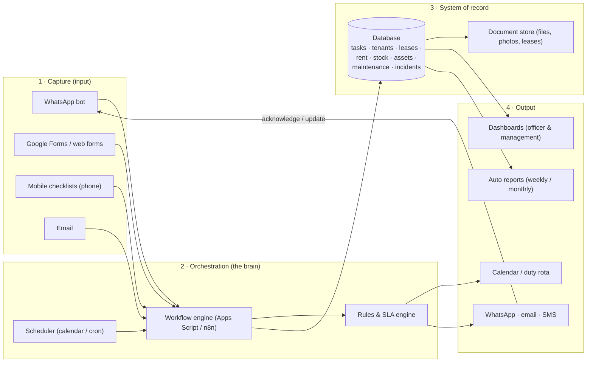
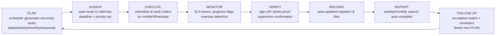
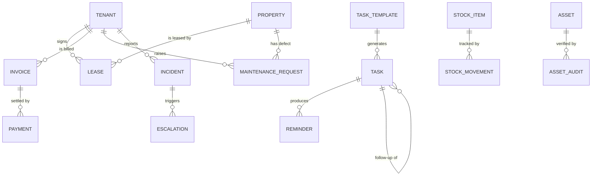

# Automation Architecture
### Administrative Officer — Farm & Property Management

> Companion document: [`activity-inventory.md`](activity-inventory.md) (full automation matrix).
> Working prototype: [`app/`](../app).

---

## 1. Executive summary

The Administrative Officer's role is a classic **coordination hub**: 14 key operational areas, a
daily routine, a weekly cycle, and a standing mandate that *"no important task is left without a
responsible person, deadline, documented status or follow-up action."*

Today this runs on paper registers, memory and manual follow-up. The proposed architecture
automates the **control cycle itself** — planning, assignment, execution tracking, monitoring,
verification, recording, reporting and follow-up — while keeping the **human decisions** (vetting
tenants, resolving disputes, prioritising) exactly where they belong: with the officer.

**The core idea:** replace the paper register with a **system of record** that (a) *generates* the
recurring work automatically, (b) *reminds* the right person at the right time, (c) *tracks* every
item to completion, (d) *escalates* what is stuck, and (e) *compiles* the weekly/monthly reports on
its own. Nothing is invented; everything traces back to the existing workplan.

**Expected outcomes:**
- No task lost, duplicated or late without a visible reason.
- Weekly/monthly reports produced in minutes instead of hours.
- Rent arrears, lease renewals and defects surfaced *before* they become problems.
- Full audit trail of who did what, when, with what result.

---

## 2. Scope & source documents

| Source | Contents used |
| --- | --- |
| `Administrative_Officer_Farm_Property_Coordination_Workplan.pdf` | 14 key areas, daily/weekly routines, task tracking register, control cycle, performance expectations |
| `Administrative_Officer_Job_Description-1.pdf` | Tenant placement, lease admin, rent collection, maintenance, records, legal compliance, customer service, authority & working relationships |

Out of scope (handled separately): payroll/HR, financial accounting software (general ledger),
statutory tax filing — though the system exports data to those where needed.

---

## 3. Goals & design principles

| # | Principle | What it means here |
| --- | --- | --- |
| G1 | **The register is the truth** | One system of record replaces all paper registers; every event updates it automatically. |
| G2 | **Automate the routine, assist the judgement** | Scheduling, reminders, recording and compiling are automated; decisions stay human. |
| G3 | **Right person, right time, right device** | Notifications reach staff on the tools they already use (WhatsApp, email, phone). |
| G4 | **No orphan tasks** | Every task has a responsible person + deadline + status; the follow-up loop closes the cycle. |
| G5 | **Low cost, low IT dependency** | Start on Google Workspace (or free tiers); scale to self-hosted only when volumes demand it. |
| G6 | **Runs even when offline-ish** | Mobile-friendly capture with graceful degradation for low connectivity (Lesotho rural sites). |
| G7 | **Audit-ready** | Every change is time-stamped and attributed — required for lease/legal compliance. |

---

## 4. Target architecture

### Layer descriptions

**1 · Capture.** Anything that starts a piece of work enters here — a tenant's WhatsApp complaint,
an inspection checklist filled on a phone, an incident report, an application form. The officer
never re-types information.

**2 · Orchestration.** The brain. The *scheduler* fires recurring work (daily routine, weekly
cycle, monthly reports, seasonal crop calendar, lease-renewal and rent-due dates). The *workflow
engine* moves each item through its lifecycle (request → work order → completion). The *rules/SLA
engine* decides when to remind and when to escalate (e.g. arrears > 30 days → Head of Support
Services).

**3 · System of record.** One database for all entities (tasks, tenants, properties, leases,
invoices, stock, assets, maintenance, incidents) plus a document store for files (signed leases,
photos, receipts). This is the digital twin of the paper registers.

**4 · Output.** Calendars & duty rotas for staff, notifications via WhatsApp/email/SMS,
dashboards for the officer and management, and auto-compiled reports.

---

## 5. Mapping the control cycle to automation

The workplan's **PLAN → ASSIGN → EXECUTE → MONITOR → VERIFY → RECORD → REPORT → FOLLOW UP** cycle
is the heart of the system. Every stage gets an automation component:

| Stage | Paper today | Automated tomorrow |
| --- | --- | --- |
| PLAN | Officer lists tasks from memory | Scheduler emits every recurring task on its due date (incl. seasonal crop calendar) |
| ASSIGN | Verbal allocation | Auto-routing to the responsible role/rota with deadline & priority |
| EXECUTE | Paper checklists | Mobile checklist / work order; one-tap updates |
| MONITOR | Officer chases people | Live board; overdue & SLA flags computed automatically |
| VERIFY | Manual inspection | Sign-off workflow + photo proof attached |
| RECORD | Hand-written registers | Every event writes its register automatically |
| REPORT | Manual compilation | Auto-compiled weekly/monthly reports, scheduled delivery |
| FOLLOW UP | Ad-hoc | Escalation matrix triggers automatically at thresholds |

---

## 6. Data model (core entities)

Key fields per entity (starting point):

- **TASK** — title, area, responsible, priority (High/Med/Low), due date, status (Pending / In
  Progress / Completed / Escalated), follow-up-of, proof link, timestamps.
- **TENANT / PROPERTY / LEASE** — identity & contact; unit; lease start/end; rent; status.
- **INVOICE / PAYMENT** — amount, due date, paid date, arrears computed.
- **MAINTENANCE_REQUEST** — description, priority, contractor, status, SLA due.
- **STOCK_ITEM** — item, category, qty on hand, reorder level, last count.
- **ASSET** — tag (QR), location, status, last audit.
- **INCIDENT** — type (loss/damage/illness/theft/accident/dispute), severity, status, escalation.

The `TASK_TEMPLATE` table is the automation keystone: one row per recurring activity (frequency,
responsible, indicator). The scheduler reads it daily and *materialises* due work into `TASK`.

---

## 7. Scheduling & triggers

Three trigger classes cover every activity:

| Class | Examples | Mechanism |
| --- | --- | --- |
| **Time-based** | Daily routine (morning/end-of-day), weekly Mon/Wed/Fri cycle, monthly stock count & reports, quarterly asset audit, seasonal crop calendar | Scheduler (Google Calendar + Apps Script, or cron/APScheduler) materialises tasks from templates |
| **Event-based** | Tenant complaint, maintenance request, incident, lease sign/renew/terminate, payment received | Inbound message/form/webhook starts a workflow |
| **Threshold-based** | Arrears > 30 days, stock below reorder level, SLA about to breach, lease expiring in ≤ 90 days | Rules engine evaluates on each change and on a daily sweep |

### The recurring calendar (single source of truth)

| Cadence | What fires | Examples |
| --- | --- | --- |
| Daily | 3 routines | Morning briefing · end-of-day summary · livestock/attendance checks |
| Weekly | Mon / Wed / Fri | Planning · mid-week inspection · Friday review + weekly report |
| Monthly | 1st | Occupancy review · stock count · rent run · monthly management report |
| Quarterly | 1st Jan/Apr/Jul/Oct | Asset register audit |
| Seasonal | per crop calendar | Planting → weeding → fertilising → irrigation → harvesting |
| Event | on occurrence | Requests, incidents, lease lifecycle, payments |

---

## 8. Notifications & escalation

- **Channel selection** is per recipient: staff/caretakers → **WhatsApp** (ubiquitous, low-bandwidth);
  officer/management → **email** + dashboard; tenants → WhatsApp/SMS for notices & receipts.
- **Reminder ladder:** e.g. task due → remind 1 day before → on due day → overdue (daily) →
  escalate to officer at +2 days → escalate to Head of Support Services at +5 days.
- **Escalation matrix** mirrors the reporting line in the job description (officer → Head of
  Support Services → management), with special rules for incidents (immediate) and arrears (30/60/90
  day thresholds → formal notice).
- Every notification is **actionable**: it links back to the item so a reply/ack updates status.

---

## 9. Reporting & dashboards

- **Live dashboards** for the officer: today's tasks, overdue, open maintenance, arrears aging,
  low stock, vacancies, incidents open.
- **Auto reports** (no manual assembly):
  - *Daily operational summary* (end of day).
  - *Weekly management report* (Friday) — matches the workplan's "Weekly Performance Review"
    (planned / completed / outstanding / delayed / achievements / challenges / corrective actions /
    next-week priorities).
  - *Monthly reports* — rent collection, occupancy, maintenance, stock, assets, incidents.
- Reports are **auto-archived** into the records layer (satisfying area 12 "Records").

---

## 10. Exception handling & failure modes

| Failure | Safeguard |
| --- | --- |
| No response to a notification | Reminder ladder + escalation (never silent) |
| Missed verification (no sign-off) | Task cannot be "Completed" without proof/sign-off; flag for review |
| Data entry errors | Drop-downs, validation, and variance reports (stock) catch anomalies |
| Connectivity loss (farm sites) | Mobile capture queues offline and syncs later |
| System down | Daily export/backup of the database; paper register as fallback only during outage |
| Unauthorised access | Role-based access; audit log of all changes (legal/lease requirement) |

---

## 11. Technology options & recommendation

### Option A — Google Workspace (recommended to start)
**Google Sheets** (system of record v1) + **Google Forms** (capture) + **Google Calendar**
(scheduling) + **Apps Script** (workflow glue) + **Gmail** (notifications) + **WhatsApp Business**
(tenant/staff comms) + **Looker Studio** (dashboards).

- ✅ Near-zero cost, no server, works offline-tolerant, familiar, fast to stand up (2–4 weeks).
- ⚠️ Manual ceiling: gets unwieldy past ~1,000 records or complex cross-entity logic.

### Option B — Open-source self-hosted (scale-up)
**n8n** (workflow engine) + **PostgreSQL** (database) + **Metabase** (dashboards) +
**Paperless-ngx** (document store) + **Appsmith** (forms/dashboard UI) + WhatsApp via Twilio/Turn.

- ✅ Unlimited logic, full ownership, audit-ready, low running cost (a small VPS).
- ⚠️ Needs basic IT support to install/maintain.

### Option C — Custom application (long term)
Python/FastAPI + APScheduler + PostgreSQL + a web/mobile UI (the prototype in `app/` is the seed of
this). Best when the workflow is stabilised and requirements are known.

**Recommended path: A → B → C.** Start on Option A to prove value in weeks, migrate to B when
volumes grow, and only build C for anything truly unique.

---

## 12. Security, privacy & compliance

- **POPIA-style data protection:** tenant personal data is limited-access, encrypted at rest, and
  subject to retention rules (keep lease/rent records per statutory periods).
- **Role-based access:** caretakers see only their tasks; officer sees everything; management sees
  dashboards/reports.
- **Audit trail:** who changed what, when — required for lease & legal compliance.
- **Backups:** automated daily backup, off-site copy (Google Drive / object storage).

---

## 13. Implementation roadmap

| Phase | Time | Goal | Deliverables |
| --- | --- | --- | --- |
| **0 · Baseline & digitise** | Weeks 1–2 | Get everything into one trusted place | Master task register, tenant/property/lease/stock/asset registers in Sheets; calendars set up; WhatsApp Business number. |
| **1 · Automate scheduling & reminders** | Weeks 3–6 | Stop relying on memory | Recurring task generation (daily/weekly/monthly/seasonal); reminder ladder; end-of-day & Friday reports auto-compiled. |
| **2 · Digitise capture** | Weeks 7–12 | Kill paper forms | WhatsApp/Form intake for tenant requests, incidents, attendance, stock counts, inspections (mobile checklists). |
| **3 · Workflow automation** | Months 4–6 | Automate the value chains | Maintenance work orders; procurement approvals; arrears & renewal escalation; rent invoicing & receipts. |
| **4 · Analytics & continuous improvement** | Months 6–12 | Make it self-improving | Dashboards, KPI tracking, predictive alerts (e.g. renewals, seasonal buying), policy refinement. |

---

## 14. KPIs & success measures

| KPI | Target (suggested) | Source |
| --- | --- | --- |
| Task completion rate | ≥ 95% | Task register |
| Overdue tasks | < 5% of open tasks | Task register |
| Tenant request resolution | within agreed SLA ≥ 90% | Tickets |
| Inspection completion | 100% of scheduled | Inspection log |
| Occupancy record accuracy | 100% | Occupancy register |
| Rent arrears | declining 30/60/90-day buckets | Tenant ledger |
| Stock variance | < 1% unexplained | Stock ledger |
| Reports on time | 100% | Report log |
| Incident response | escalated < 1 hour (serious) | Incident log |

---

## 15. Risks & mitigations

| Risk | Likelihood | Impact | Mitigation |
| --- | --- | --- | --- |
| Low staff tech literacy | Medium | High | WhatsApp-first UX; simple forms; hands-on training; super-simple dashboards |
| Connectivity at farm sites | High | Medium | Offline-capable mobile capture + sync |
| Data quality (garbage in) | Medium | High | Validation, drop-downs, variance reports, weekly data review |
| Resistance to change | Medium | Medium | Start with the parts that save *their* time (reports & reminders); celebrate quick wins |
| Single-person dependency (the officer) | Medium | High | System holds all knowledge (not one person's memory); documented processes |

---

## 16. Next steps

1. Approve the **target architecture** and **Option A** starting stack.
2. Stand up the **master registers** (Phase 0) — the prototype's seed data is the starting template.
3. Configure the **recurring calendar** and **reminder ladder** (Phase 1) — highest value, lowest cost.
4. Pilot **one event-driven workflow** (e.g. tenant requests or maintenance) end-to-end before
   rolling out the rest.

---

*Prepared as a living document — update it as the automation matures.*
