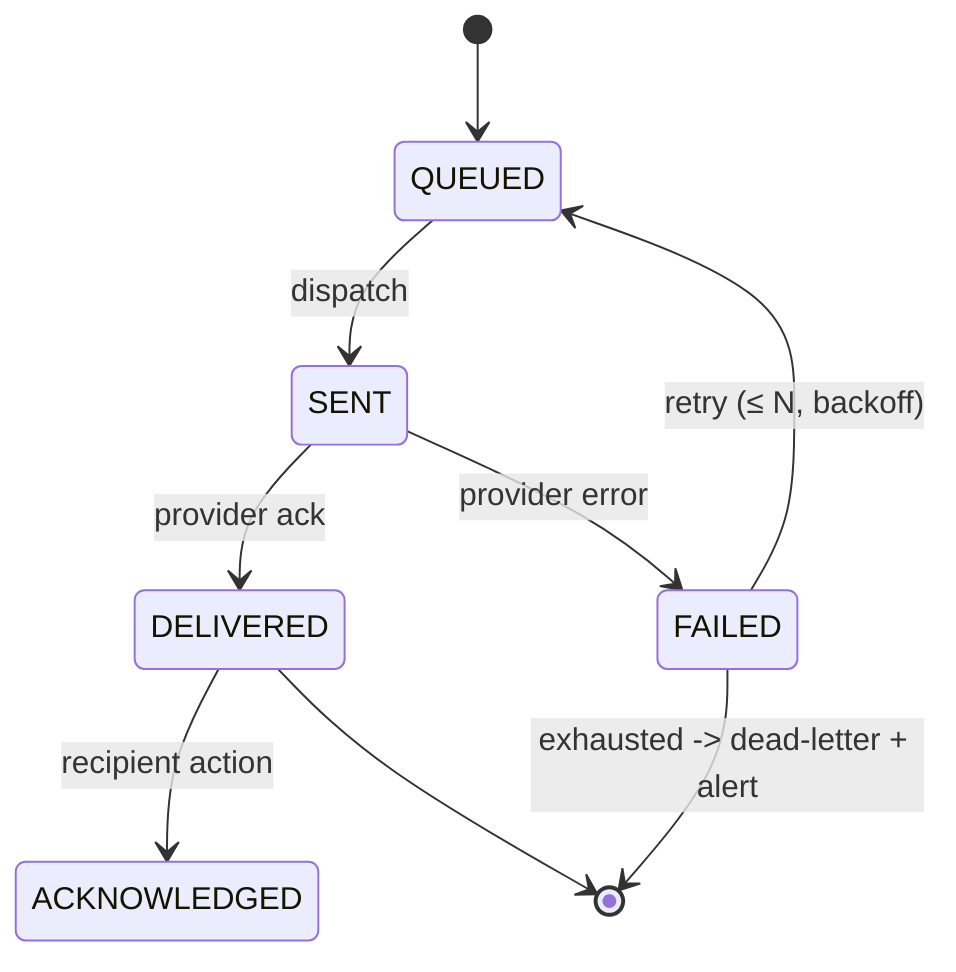

# Automation Engines — Task Templates, Scheduler, Notifications & Escalations
## Architecture package — items 9, 10, 11

> Master document: [`architecture.md`](architecture.md). These three engines are the heart of the
> platform: they make recurring work automatic, observable and auditable.

---

## 1. Task Template Engine (§7)

Recurring work must never depend on memory. A **task template** is the definition of a recurring (or
event-triggered) piece of work; the scheduler **materialises** it into concrete `TASK` rows.

### 1.1 Template schema

| Field | Type | Notes |
| --- | --- | --- |
| name, domain, description | text | |
| cadence | enum | `ONCE, DAILY, WEEKLY, MONTHLY, QUARTERLY, ANNUAL, CUSTOM, EVENT` |
| frequency, day, time | | e.g. WEEKLY + Monday + 08:00 |
| responsible_role / default_assignee | | routing target |
| priority | enum | High/Med/Low |
| sla | ref | SLA profile (e.g. "complete within 8h") |
| verification_required / evidence_required | bool | |
| notification_rule | json | when/how to notify (see §3) |
| escalation_rule | json | which ladder (see §4) |
| active, effective_date, expiry_date | | lifecycle |

### 1.2 Template catalogue (derived from the workplan — `PROVEN`)

| Template | Cadence | Due | Responsible | Verification | Evidence |
| --- | --- | --- | --- | --- | --- |
| Morning briefing (attendance, duties, livestock) | DAILY | 08:00 | Officer | — | — |
| Livestock feeding/watering/health/count | DAILY | 07:30 | Caretaker | supervisor | count |
| Attendance & duty allocation | DAILY | 07:00 | Supervisor | — | — |
| Crop/livestock coordination | DAILY | 09:00 | Supervisor | — | — |
| Maintenance log & coordination | DAILY | 10:00 | Caretaker | — | — |
| Records update (registers current) | DAILY | 16:00 | Officer | — | — |
| End-of-day verify, escalate, daily summary | DAILY | 16:30 | Officer | — | — |
| Weekly planning & allocation | WEEKLY Mon | 08:00 | Officer | — | — |
| Mid-week inspection | WEEKLY Wed | 09:00 | Caretaker Sup. | officer | photos |
| Weekly review + report | WEEKLY Fri | 14:00 | Officer | — | report |
| Occupancy & lease review | MONTHLY 1st | 09:00 | Officer | — | — |
| Stock count | MONTHLY 1st | 10:00 | Officer | — | counts |
| Monthly management report | MONTHLY 1st | 15:00 | Officer | — | report |
| Asset audit | QUARTERLY | 09:00 | Officer | — | audit |
| Preventative maintenance | per schedule | | Caretaker | officer | — |
| Compliance reviews | per obligation | | Officer | HoSS | doc |
| Crop activities (plant/weed/fertilise/irrigate/pest/harvest) | CUSTOM (crop calendar) | | Farm workers | supervisor | — |

> All cadences/times are configuration (`SYSTEM_SETTING`), not hard-coded (§63).

### 1.3 Occurrence keys & idempotency

- Deterministic key: **`template_id + occurrence_date`** (unique constraint on `TASK_OCCURRENCE`).
- Materialisation is `INSERT … ON CONFLICT DO NOTHING` — a scheduler re-run never duplicates work.
- Event templates produce tasks via their event, not the time sweep.

---

## 2. Scheduler Architecture (§8)

### 2.1 Responsibilities

1. **Time triggers** — materialise tasks from templates (daily/weekly/monthly/quarterly/annual/custom).
2. **Event triggers** — subscribe to the event bus; create tasks on `tenant.request.created`,
   `lease.expiring`, `stock.reorder.triggered`, `incident.reported`, etc.
3. **Threshold triggers** — evaluate rules daily (and on each relevant event): arrears overdue,
   stock ≤ reorder, SLA breached, lease ≤ 90 d, asset missing, variance > threshold.

### 2.2 Design properties

| Property | Implementation |
| --- | --- |
| Idempotent | occurrence keys + event idempotency keys; re-runs are safe |
| Retryable | job records with attempts + backoff; failures → dead-letter (visible, not silent) |
| Observable | `SYSTEM_EVENT` + `AUDIT_LOG` per run; "why was this task created?" is answerable (§66) |
| Timezone-aware | all scheduling in **Africa/Maseru**; store timestamps with offset |
| Auditable | every materialisation links template → scheduler run → occurrence → task (§69) |

### 2.3 Run loop (Option B / C reference)

```text
every minute:
  1. sweep due time-triggers  -> materialise TASK rows (idempotent)
  2. sweep threshold rules    -> evaluate vs live data -> create tasks/alerts
  3. process event queue      -> event templates -> tasks
  4. run reminder/escalation ladder (see §3/§4)
  5. write SYSTEM_EVENT (heartbeat) + failures to DEAD_LETTER
```

### 2.4 Backfill & catch-up

- **First run** generates the configured window (e.g. today −4 … today +14) so escalation history is
  visible and near-term work is pre-loaded.
- **After downtime**, the missed span is regenerated (idempotent, no duplicates).
- Seasonal/event tasks are **not** backfilled by the time sweep.

---

## 3. Notification Engine (§10)

### 3.1 Channels

`IN_APP` (always) · `WHATSAPP` · `EMAIL` · `SMS` (adapter-ready, no active credentials assumed).

### 3.2 Notification record

```text
recipient, channel, template, subject, body, related entity, action/deep link,
priority, created_time, delivery_status, acknowledgement_status, retry_count
```

### 3.3 States



- **De-duplication:** one notification per (recipient, entity, template, period) — no spam.
- **Actionable:** deep links back to the record; replying/acking updates the record where applicable.
- **Quiet hours** configurable (no non-urgent sends outside 07:00–19:00).

### 3.4 Channel routing matrix (role-based)

| Recipient | In-app | WhatsApp | Email | SMS |
| --- | :-: | :-: | :-: | :-: |
| Officer | ✔ | urgent | reports | emergencies |
| Caretaker Supervisor | ✔ | ✔ | — | — |
| Caretaker / Farm worker | ✔ | ✔ | — | — |
| Contractor | ✔ | ✔ | work orders | — |
| Tenant | ✔ | notices | notices/receipts | — |
| HoSS / Management | ✔ | — | ✔ | — |

### 3.5 Templates

All messages are templated with merge fields (`{{tenant}}`, `{{unit}}`, `{{amount}}`, `{{due_date}}`,
`{{deadline}}`), localised (en/st — `INFERRED`), and stored in `SYSTEM_SETTING`/template store so
wording is editable without code.

---

## 4. Escalation Engine (§11)

### 4.1 Default task ladder (configurable, not hard-coded)

| Offset | Action | Audience |
| --- | --- | --- |
| D−1 | "Due tomorrow" | assignee |
| D0 (07:00) | "Due today" | assignee |
| D+1 | "Overdue" | assignee |
| D+2 | Escalate → officer | officer |
| D+5 | Escalate → Head of Support Services | HoSS |

### 4.2 Domain-specific ladders

| Trigger | Threshold | Action | Authority |
| --- | --- | --- | --- |
| Rent arrears | 30 d | reminder + statement | officer |
| | 60 d | formal notice (template) | officer |
| | 90 d | legal referral **draft** (human sends) | HoSS |
| Lease expiry | −90/−60/−30 d | renewal notice + task | officer |
| SLA breach | per ticket class | alert officer | officer |
| Incident CRITICAL | immediate | notify officer + HoSS | officer |
| Stock ≤ reorder | immediate | reorder draft | officer |
| Asset missing | immediate | investigation task + alert | officer |
| Variance > threshold | on reconcile | investigation task | officer |

### 4.3 Rule manager (§35)

Administrators configure rules as data:

```text
RULE = { trigger (event|threshold|time), condition, recipient(role/user),
         channel, timing (offset), escalation (next level) }
```

Every firing is recorded (who was notified, when, why) — automation itself is auditable (§69).

---

*Next in package: [`api-contract.md`](api-contract.md).*
