# Data Model & Entity Dictionary
## Architecture package — items 4 & 5

> Master document: [`architecture.md`](architecture.md). Assumption classifications:
> [`assumptions.md`](assumptions.md).

---

## 1. Design rules

- Properly normalised relational model (Option A starts in Sheets with the same columns; Option B is
  PostgreSQL with real FKs — see [`architecture.md`](architecture.md) §11).
- Explicit **foreign keys** and **unique constraints**; no uncontrolled JSON blobs where relational
  modelling is appropriate (JSON allowed only for true flex structures: checklist definitions,
  event payloads, report snapshots).
- **Append-only** financial/legal records: corrections use reversal/adjustment rows, never overwrite.
- **Soft delete** for operational records; permanent deletion is a privileged operation (§68).
- Every mutable table carries `created_at`, `updated_at`, `created_by`; audit history is separate in
  `AUDIT_LOG`.
- Field types below are PostgreSQL-style; `enum` values come straight from the master prompt.

---

## 2. Entity relationship diagram (conceptual)

```mermaid
erDiagram
    USER ||--o{ USER_ROLE : has
    ROLE ||--o{ USER_ROLE : granted
    ROLE ||--o{ ROLE_PERMISSION : grants
    PERMISSION ||--o{ ROLE_PERMISSION : allows

    PROPERTY ||--o{ UNIT : contains
    UNIT ||--o{ LEASE : "leased via"
    TENANT ||--o{ APPLICATION : submits
    APPLICATION ||--o| TENANT : "approved as"
    TENANT ||--o{ LEASE : signs
    LEASE ||--o| OCCUPANCY : "active as"

    LEASE ||--o{ INVOICE : billed
    INVOICE ||--o{ PAYMENT : "settled by"
    INVOICE ||--o| RECEIPT : "receipted by"
    TENANT ||--o{ DEPOSIT : holds
    DEPOSIT ||--o| REFUND : "released via"

    TENANT ||--o{ TICKET : raises
    TICKET ||--o{ MAINTENANCE_REQUEST : "may become"
    UNIT ||--o{ MAINTENANCE_REQUEST : "has defect"
    MAINTENANCE_REQUEST ||--o{ WORK_ORDER : "fulfilled by"
    WORK_ORDER }o--|| CONTRACTOR : "assigned to"
    WORK_ORDER ||--o{ QUOTE : quoted
    INSPECTION ||--o{ FINDING : produces
    FINDING ||--o{ DEFECT : records
    DEFECT ||--o{ MAINTENANCE_REQUEST : "becomes"

    TASK_TEMPLATE ||--o{ TASK : generates
    TASK ||--o{ REMINDER : produces
    TASK ||--o{ ESCALATION : triggers
    TASK ||--o{ TASK : "follow-up of"

    CROP ||--o{ CROP_PLAN : planned
    CROP_PLAN ||--o{ CROP_ACTIVITY : schedules
    FIELD ||--o{ CROP_PLAN : "is planted on"
    WORKER ||--o{ ATTENDANCE : records
    WORKER ||--o{ DUTY : "allocated"
    WORKER ||--o{ TEAM : "member of"
    LIVESTOCK_GROUP ||--o{ LIVESTOCK_RECORD : "daily record"

    STOCK_ITEM ||--o{ STOCK_MOVEMENT : "tracked by"
    STOCK_ITEM ||--o{ STOCK_COUNT : counted
    STOCK_COUNT ||--o{ STOCK_VARIANCE : "reveals"
    ASSET ||--o{ ASSET_AUDIT : "verified by"
    SUPPLIER ||--o{ PURCHASE_ORDER : supplies
    PURCHASE_REQUEST ||--o| PURCHASE_ORDER : "approved into"
    PURCHASE_ORDER ||--o{ GOODS_RECEIPT : "received via"

    INCIDENT ||--o{ INCIDENT_ESCALATION : "escalated via"
    COMPLIANCE_OBLIGATION ||--o{ COMPLIANCE_EVIDENCE : satisfied
    DOCUMENT ||--o{ DOCUMENT_VERSION : versioned
    DOCUMENT }o--|| DOCUMENT_CATEGORY : filed
    NOTIFICATION ||--o{ COMMUNICATION : delivered
    USER ||--o{ NOTIFICATION : receives
    REPORT ||--o| DOCUMENT : archived
    USER ||--o{ AUDIT_LOG : "recorded by"
    SYSTEM_EVENT }o--|| USER : "caused by"
```

---

## 3. Data dictionary

### 3.1 Identity & access

| Entity | Field | Type | Notes |
| --- | --- | --- | --- |
| USER | id | uuid PK | |
| | full_name, email (unique), phone | text | |
| | password_hash | text | never store plaintext |
| | status | enum(ACTIVE, SUSPENDED, LOCKED, PENDING) | |
| | mfa_enabled | bool | MFA-ready from day one |
| | locale | enum(en, st) | `INFERRED` |
| | created_at, updated_at, last_login_at | timestamptz | |
| ROLE | id, name, description | | seeded from §5 |
| PERMISSION | id, module, action, record_scope, field_scope | | module→action→record→field (§5) |
| USER_ROLE | user_id FK, role_id FK, scope_id (nullable) | | scoped assignments |
| ROLE_PERMISSION | role_id FK, permission_id FK | | |
| SESSION | id, user_id, token_hash, expires_at, revoked_at, ip, device | | |

### 3.2 Property & tenancy

| Entity | Field | Type | Notes |
| --- | --- | --- | --- |
| LOCATION | id, name, gps (nullable), address | | |
| PROPERTY_TYPE | id, name (Farm, Residential, Mixed) | | |
| PROPERTY | id, name, code (unique), location_id FK, type_id FK, status, description, facilities | | status enum(ACTIVE, INACTIVE) |
| UNIT | id, property_id FK, code (unique per property), type, size, condition, occupancy_status, rent, deposit, availability_date | | occupancy_status enum(VACANT, OCCUPIED, MAINTENANCE, RESERVED, INACTIVE) |
| TENANT | id, full_name, phone, email, id_number (nullable), status, notes | | status enum(PROSPECT, ACTIVE, FORMER) |
| APPLICATION | id, tenant_id FK (nullable pre-creation), unit_id FK, status, applied_at, vetting_checklist jsonb, vetting_notes, recommendation, decision, decision_by FK USER, decision_at | | status enum(RECEIVED, SCREENING, VETTING, RECOMMENDED, APPROVAL, APPROVED, REJECTED, OFFER, ACCEPTED, DECLINED, MOVE_IN) |
| LEASE | id, tenant_id FK, unit_id FK, start_date, end_date, rent, deposit, payment_frequency, status, signed_doc_id FK DOCUMENT | | status enum(DRAFT, REVIEW, SIGNATURE_PENDING, SIGNED, ACTIVE, EXPIRING, RENEWED, TERMINATING, CLOSED, ARCHIVED) |
| OCCUPANCY | id, unit_id FK, tenant_id FK, lease_id FK, start_date, end_date | | derived/held for history |

### 3.3 Rent & finance (append-only ledger)

| Entity | Field | Type | Notes |
| --- | --- | --- | --- |
| INVOICE | id, lease_id FK, tenant_id FK, billing_period, amount, due_date, status | | status enum(ISSUED, PARTIALLY_PAID, PAID, OVERDUE, CANCELLED) |
| PAYMENT | id, invoice_id FK, amount, method, reference (unique per method), payment_date, receipt_id FK, recorded_by FK USER, reversal_of FK PAYMENT (nullable) | | **append-only**; corrections = reversal rows |
| RECEIPT | id, payment_id FK, number, doc_id FK DOCUMENT | | |
| DEPOSIT | id, lease_id FK, amount, status, held_since | | status enum(HELD, REFUNDED, FORFEITED) |
| REFUND | id, deposit_id FK, amount, date, method, approved_by FK USER | | approval required |
| TENANT_LEDGER | id, tenant_id FK, entry_type, amount, balance_after, related_id, created_at | | materialised running balance; recomputable |

### 3.4 Service desk, maintenance, inspection

| Entity | Field | Type | Notes |
| --- | --- | --- | --- |
| TICKET | id, tenant_id FK, channel, subject, description, category, priority, sla_id FK, assigned_to FK USER, status, resolution | | status enum(OPEN, ACKNOWLEDGED, IN_PROGRESS, WAITING, RESOLVED, CLOSED, ESCALATED) |
| MAINTENANCE_REQUEST | id, property_id FK, unit_id FK, reporter_id, description, category, priority, sla_due_at, status, source_ticket_id FK (nullable), source_inspection_id FK (nullable) | | status enum(REPORTED, TRIAGED, ASSIGNED, IN_PROGRESS, COMPLETED, VERIFIED, CLOSED, CANCELLED) |
| WORK_ORDER | id, request_id FK, contractor_id FK (nullable), scope, quote_id FK, approved_amount, scheduled_at, completed_at, evidence_doc_id FK, verified_by FK USER, verified_at | | |
| CONTRACTOR | id, name, contact, trade, insurance_expiry, status | | |
| QUOTE | id, work_order_id FK, amount, notes, status | | |
| INSPECTION | id, type, unit_id FK (nullable), asset_id FK (nullable), checklist_definition_id FK, scheduled_at, done_at, report_doc_id FK, status | | type enum(MOVE_IN, MOVE_OUT, ROUTINE, MAINTENANCE, ASSET) |
| FINDING | id, inspection_id FK, description, severity, photo_doc_ids | | |
| DEFECT | id, finding_id FK (nullable), unit_id FK, description, category, status, maintenance_request_id FK (nullable) | | |

### 3.5 Task engine & scheduling

| Entity | Field | Type | Notes |
| --- | --- | --- | --- |
| TASK_TEMPLATE | id, name, domain, description, cadence, frequency, day, time, responsible_role, default_assignee_id, priority, sla_id, verification_required, evidence_required, notification_rule jsonb, escalation_rule jsonb, active, effective_date, expiry_date | | cadence enum(ONCE, DAILY, WEEKLY, MONTHLY, QUARTERLY, ANNUAL, CUSTOM, EVENT) |
| TASK | id, template_id FK (nullable), title, description, domain, category, source, entity_type, entity_id, owner_id FK USER, assignee_id FK USER (nullable), team_id FK (nullable), priority, status, due_date, due_time, start_date, completion_date, verification_required, verifier_id, evidence_required, evidence_doc_id, notes, follow_up_of FK TASK (nullable), escalation_level, sla_id, created_by, created_at, updated_at, completion_reason, cancellation_reason | | status enum(PENDING, ASSIGNED, IN_PROGRESS, BLOCKED, SUBMITTED, VERIFICATION_REQUIRED, COMPLETED, REJECTED, ESCALATED, CANCELLED) |
| TASK_OCCURRENCE | template_id FK, occurrence_date, occurrence_key (unique), task_id FK | | `template_id + occurrence_date` dedup key |
| REMINDER | id, task_id FK, kind, due_at, delivered, ack | | kinds: DUE_SOON, DUE, OVERDUE, ESCALATION |
| ESCALATION | id, task_id FK, level, escalated_at, to_role, to_user_id, reason | | |

### 3.6 Farm

| Entity | Field | Type | Notes |
| --- | --- | --- | --- |
| FIELD | id, name, area, status | | |
| CROP | id, name, variety, season_start, season_end | | |
| CROP_PLAN | id, crop_id FK, field_id FK, season, status | | status enum(PLAN, SCHEDULED, ACTIVE, COMPLETE) |
| CROP_ACTIVITY | id, crop_plan_id FK, activity, due_window_start, due_window_end, task_id FK, done_at, verified_by | | activity enum(PLANTING, WEEDING, FERTILISING, IRRIGATION, PEST_CONTROL, HARVESTING) |
| LIVESTOCK_GROUP | id, species, count, location, status | | species enum(…configurable) |
| LIVESTOCK_RECORD | id, group_id FK, date, feeding, watering, health_check, count_in, count_out, deaths, notes, task_id FK | | daily, auto-generated via template |
| WORKER | id, full_name, phone, role, status | | |
| TEAM | id, name, supervisor_id FK USER | | |
| TEAM_MEMBER | team_id FK, worker_id FK | | |
| ATTENDANCE | id, worker_id FK, date, present, time_in, time_out, verified_by FK USER, notes | | export-only to HR/payroll |
| DUTY | id, worker_id FK, date, task_id FK, description, status | | |
| ROTA | id, team_id FK, week_start, duty_plan jsonb | | `INFERRED` shape |

### 3.7 Stock, assets, procurement

| Entity | Field | Type | Notes |
| --- | --- | --- | --- |
| STOCK_ITEM | id, name, category, unit, location, reorder_level, qty_on_hand, last_count_at | | qty_on_hand = computed balance |
| STOCK_MOVEMENT | id, item_id FK, type, qty, ref, related_id, by_user_id, at | | type enum(RECEIPT, ISSUE, TRANSFER, ADJUSTMENT, COUNT) |
| STOCK_COUNT | id, item_id FK, scheduled_at, counted_at, counted_by, expected_qty, counted_qty, status | | status enum(SCHEDULED, IN_PROGRESS, SUBMITTED, RECONCILIATION, VARIANCE_REVIEW, ADJUSTED, CLOSED) |
| STOCK_VARIANCE | id, count_id FK, expected, actual, variance, threshold_exceeded, investigation_task_id FK, status | | |
| ASSET | id, name, category, serial_number, location, custodian_id FK, acquisition_date, condition, status, value, qr_code, last_audit, notes | | status enum(ACTIVE, MAINTENANCE, MISSING, DAMAGED, DISPOSED, RETIRED) |
| ASSET_AUDIT | id, asset_id FK, scheduled_at, audited_at, found, condition, auditor_id, missing → investigation task | | |
| SUPPLIER | id, name, contact, category, status | | |
| PURCHASE_REQUEST | id, requester_id FK, description, item_link (stock/asset), est_cost, status, approver_id, approved_at | | status enum(REQUESTED, REVIEW, APPROVAL, APPROVED, REJECTED) |
| PURCHASE_ORDER | id, request_id FK, supplier_id FK, po_number, total, status | | status enum(DRAFT, ISSUED, ORDERED, RECEIVED, CLOSED, CANCELLED) |
| GOODS_RECEIPT | id, purchase_order_id FK, received_at, received_by, qty, condition, → stock receipt movement / asset creation | | |

### 3.8 Incidents, compliance, records

| Entity | Field | Type | Notes |
| --- | --- | --- | --- |
| INCIDENT | id, type, description, severity, reported_by, reported_at, location, status, task_id FK | | severity enum(LOW, MEDIUM, HIGH, CRITICAL); status enum(REPORTED, ACKNOWLEDGED, ASSIGNED, INVESTIGATING, RESOLVING, RESOLVED, VERIFIED, CLOSED) |
| INCIDENT_ESCALATION | id, incident_id FK, level, at, to_role, to_user_id, reason | | |
| COMPLIANCE_OBLIGATION | id, requirement, responsible_id, due_date, frequency, authority, required_doc_id, status, reminder_schedule jsonb | | no legal advice — obligations entered by authorised user |
| COMPLIANCE_EVIDENCE | id, obligation_id FK, doc_id FK, submitted_at, status | | |
| DOCUMENT_CATEGORY | id, name (tenant, lease, receipt, invoice, maintenance, inspection, procurement, asset, compliance, report, incident) | | seeded |
| DOCUMENT | id, category_id FK, entity_type, entity_id, filename, mime, size, storage_key, uploader_id, uploaded_at, access_policy, checksum | | binary in object/file storage, metadata here (§46) |
| DOCUMENT_VERSION | id, document_id FK, version, storage_key, uploaded_by, uploaded_at, checksum | | |

### 3.9 Cross-cutting (communications, notifications, reports, audit)

| Entity | Field | Type | Notes |
| --- | --- | --- | --- |
| NOTIFICATION | id, recipient_id FK USER, channel, template, subject, body, entity_type, entity_id, action_link, priority, status, retry_count, created_at, sent_at, ack_at, correlation_id | | channel enum(IN_APP, WHATSAPP, EMAIL, SMS); status enum(QUEUED, SENT, DELIVERED, FAILED, ACKNOWLEDGED) |
| COMMUNICATION | id, direction, channel, from/to, content, entity_type, entity_id, notification_id FK (nullable), at, related | | unified external+internal history |
| REPORT | id, type, period_start, period_end, generated_at, generated_by (system/user), snapshot_ref, doc_id FK, status | | reports derive from live data; snapshot references the data window |
| REPORT_SCHEDULE | id, report_type, cadence, next_run, recipients, active | | |
| SYSTEM_EVENT | id, name, payload jsonb, idempotency_key (unique), correlation_id, created_at, processed_at, status, attempts | | event bus record |
| DEAD_LETTER | id, system_event_id FK, error, retried_at, status | | failed events never silently dropped |
| AUDIT_LOG | id, actor_id, action, entity, entity_id, before jsonb, after jsonb, at, ip, device, source, correlation_id | | **immutable** |
| SYSTEM_SETTING | id, key (unique), value, description, updated_by, updated_at | | configuration-over-hard-coding (§63) |

---

## 4. Immutability & correction model (§38, §67, §68)

- **Append-only tables:** PAYMENT, AUDIT_LOG, STOCK_MOVEMENT, TENANT_LEDGER entries.
- **Correction pattern:** original row + reversal row (negative) + corrected row; all three link via
  `reversal_of`/`correlation_id`.
- **Deletion pattern:** `status`/`deleted_at` soft-delete; permanent purge requires a privileged role
  and is itself audited.
- **Duplicates:** idempotency via `TASK_OCCURRENCE.occurrence_key`, `SYSTEM_EVENT.idempotency_key`,
  `PAYMENT.reference` uniqueness, `INVOICE(lease, period)` uniqueness.

---

*Next in package: [`role-permission-matrix.md`](role-permission-matrix.md).*
