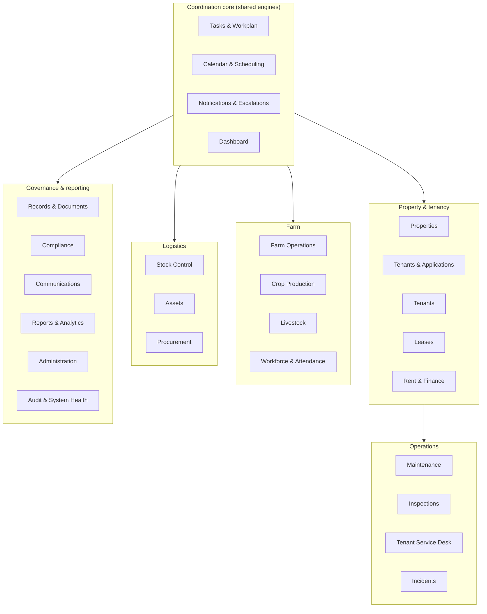
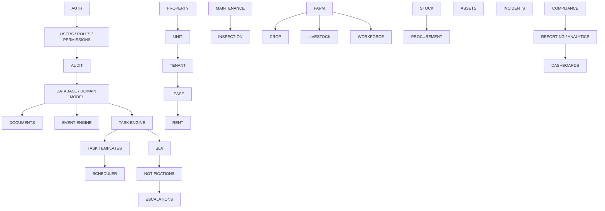

# Domain Map & Dependency Graph
## Architecture package — item 2 & 3

> Part of the architecture package. Master document: [`architecture.md`](architecture.md).
> All assumptions are classified `PROVEN` / `INFERRED` / `DECISION_REQUIRED` in
> [`assumptions.md`](assumptions.md).

---

## 1. Domain map

The platform is organised into **25 domains** (§3 of the master build prompt). Each domain owns its
business logic and entities; cross-domain flows happen through services and domain events — never
through uncontrolled direct table access.

### Domain catalogue

| # | Domain | Purpose | Core entities | Shared engines consumed |
| --- | --- | --- | --- | --- |
| 1 | **Dashboard** | Role-aware operational overview + quick actions | (derived views) | Task, Notification, Reporting |
| 2 | **Tasks & Workplan** | The coordination engine — every piece of work | TASK_TEMPLATE, TASK, REMINDER, ESCALATION | Scheduler, Notification, Workflow |
| 3 | **Properties** | Property & unit portfolio | PROPERTY, UNIT, LOCATION, PROPERTY_TYPE | Document |
| 4 | **Tenants & Applications** | Application pipeline | APPLICATION, TENANT | Workflow, Document, Notification |
| 5 | **Tenants** | 360° tenant view | TENANT (view over all links) | Timeline, Document |
| 6 | **Leases** | Lease lifecycle & renewals | LEASE, OCCUPANCY | Workflow, Scheduler, Document, Notification |
| 7 | **Rent & Finance** | Operational rent ledger (not full accounting) | INVOICE, PAYMENT, RECEIPT, DEPOSIT, REFUND | Arrears engine, Notification, Export |
| 8 | **Maintenance** | Request → work order → verification | MAINTENANCE_REQUEST, WORK_ORDER, CONTRACTOR, QUOTE, DEFECT | Task, Workflow, Notification |
| 9 | **Inspections** | Checklists → findings → defects | INSPECTION, FINDING, DEFECT | Task, Document, Maintenance (spawn) |
| 10 | **Farm Operations** | Farm control centre (view + coordination) | (cross-domain view) | Task, Crop, Livestock, Workforce |
| 11 | **Crop Production** | Crop calendar & activities | CROP, FIELD, CROP_PLAN, CROP_ACTIVITY | Task templates, Scheduler |
| 12 | **Livestock** | Daily care, counts, health | LIVESTOCK_RECORD, SPECIES/GROUP | Task templates, Scheduler |
| 13 | **Workforce & Attendance** | Workers, duties, attendance, rota | WORKER, TEAM, ATTENDANCE, DUTY, ROTA | Task, Export |
| 14 | **Stock Control** | Stock ledger, counts, variance | STOCK_ITEM, STOCK_MOVEMENT, STOCK_COUNT, STOCK_VARIANCE | Task, Procurement (spawn) |
| 15 | **Assets** | Asset register & audits | ASSET, ASSET_AUDIT | Scheduler, Document |
| 16 | **Procurement** | Request → approval → order → receipt | SUPPLIER, PURCHASE_REQUEST, PURCHASE_ORDER, GOODS_RECEIPT | Approval, Stock/Asset, Document |
| 17 | **Incidents** | Incident capture & escalation | INCIDENT, INCIDENT_ESCALATION | Task, Notification |
| 18 | **Tenant Service Desk** | Tenant enquiries/complaints/requests | TICKET | Workflow, Notification, Maintenance (spawn) |
| 19 | **Records & Documents** | Central document management | DOCUMENT, DOCUMENT_VERSION, DOCUMENT_CATEGORY | Access control |
| 20 | **Compliance** | Compliance calendar & obligations | COMPLIANCE_OBLIGATION | Scheduler, Document, Notification |
| 21 | **Communications** | Central communication history | COMMUNICATION | Notification, Document |
| 22 | **Reports & Analytics** | Reports generated from live data | REPORT, REPORT_SCHEDULE | Scheduler, Document |
| 23 | **Calendar & Scheduling** | Unified calendar view | (derived from tasks, leases, etc.) | Task, Scheduler |
| 24 | **Notifications & Escalations** | Notification centre + rule manager | NOTIFICATION, ESCALATION_RULE | — |
| 25 | **Administration** | Users, roles, permissions, configuration | USER, ROLE, PERMISSION, SYSTEM_SETTING | Audit |
| + | **Audit & System Health** | Immutable audit log + automation health | AUDIT_LOG, SYSTEM_EVENT | — |

> **Shared engines** (build once, used by all domains): Identity, Role/Permission, Task, Task
> Template, Scheduler, Workflow, Notification, Escalation, Event, Document, Audit, Search, Timeline,
> Report. These are specified in [`automation-engines.md`](automation-engines.md) and
> [`security-architecture.md`](security-architecture.md).

---

## 2. Dependency graph

Build order is dependency-driven (§71/§72). A domain must not be built before its underlying
entities exist.

### Dependency rationale (why this order)

| Edge | Rationale |
| --- | --- |
| AUTH → USERS/ROLES/PERMISSIONS → AUDIT | Identity and audit underpin every later domain |
| DATABASE → DOCUMENTS, EVENT, TASK | The three platform-wide foundations sit on the domain model |
| TASK → TEMPLATES → SCHEDULER → SLA → NOTIFICATIONS → ESCALATIONS | Each engine builds on the previous |
| PROPERTY → UNIT → TENANT → LEASE → RENT | Enforced by §51: a unit must exist before a lease; a lease before rent invoices |
| MAINTENANCE → INSPECTION | Inspection findings spawn maintenance requests |
| FARM → CROP / LIVESTOCK / WORKFORCE | Farm is the coordination umbrella |
| STOCK → PROCUREMENT | Reorder triggers procurement; receipts feed stock |
| COMPLIANCE → REPORTING → DASHBOARDS | Dashboards surface everything; reports need the full model |
| INCIDENTS, ASSETS | Independent domains, buildable once TASK/DOC/EVT exist |

---

## 3. Domain ownership rules (§65)

1. Each domain **owns its business rules** — e.g. only the Rent domain computes arrears; only the
   Lease domain changes lease status.
2. Cross-domain effects are expressed as **events** (see [`event-catalogue.md`](event-catalogue.md)),
   consumed by the owning domain.
3. No domain may write directly into another domain's tables; it calls that domain's service.
4. The **Task**, **Notification**, **Document**, **Audit** and **Event** engines are infrastructure
   services available to every domain, not domains themselves.

---

*Next in package: [`data-model.md`](data-model.md).*
