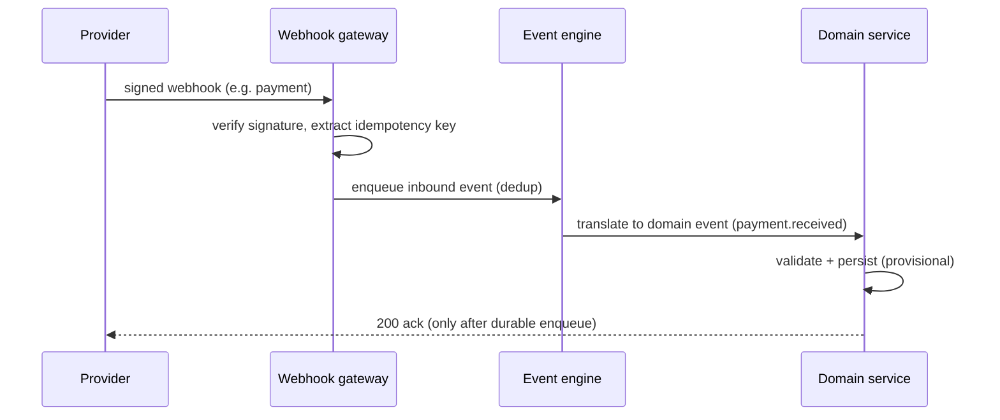

# Integration Architecture
## Architecture package — item 15

> Master document: [`architecture.md`](architecture.md). All integrations sit behind **adapters**
> (§62) so a channel can be swapped without touching core logic. **Nothing here is claimed active
> unless real credentials/specifications exist** — unconfigured adapters are visibly `INACTIVE`.

---

## 1. Adapter pattern

```text
Domain service
     │  (port: e.g. NotifyPort, PaymentPort, SignaturePort)
     ▼
Adapter (WhatsAppAdapter | EmailAdapter | MpesaAdapter | EcoCashAdapter | DocuSignAdapter | …)
     │
     ▼
External provider
```

- Core code depends on **ports (interfaces)**, never on provider SDKs directly.
- Adapters are selected by configuration; missing/disabled adapters report "not configured", never
  fake success.
- Outbound calls are wrapped in the notification/event pipeline (retry, dead-letter, idempotency).

---

## 2. Integration catalogue

| Integration | Direction | Purpose | Status | Idempotency |
| --- | --- | --- | --- | --- |
| **WhatsApp Business API** (provider `DECISION_REQUIRED`) | both | tenant requests, reminders, notices, task updates | Adapter-ready; provider TBD | `MessageSid` |
| **Email (SMTP / Google)** | outbound | reports, notices, work orders, management comms | Active (SMTP) | message-id |
| **SMS** (provider TBD) | outbound | emergencies, low-bandwidth fallback | Adapter-ready only | provider id |
| **Mobile money — M-Pesa / EcoCash** (`DECISION_REQUIRED`) | inbound | rent payment confirmation | Adapter-ready; provider TBD | provider `trans_id` |
| **Bank statement import** | inbound | reconcile bulk payments | CSV import (manual to start) | statement+ref |
| **E-signature** (provider TBD) | both | lease signing | Adapter-ready; legal validity `DECISION_REQUIRED` | envelope id+status |
| **Accounting package** | outbound | export invoices/payments (not a full ledger) | CSV/API export | batch id |
| **HR / payroll** | outbound | attendance export only | CSV export | batch id |
| **Government regulator portals** | outbound | compliance filing | manual/file export to start | — |
| **Utility providers** | outbound | account queries | manual/portal to start | — |

---

## 3. Integration principles

1. **Webhooks over polling** where the provider supports it; inbound webhooks are signature-verified
   (§44) and idempotent (§40).
2. **Versioned JSON contracts** for inbound messages; unknown versions → dead-letter, not crash.
3. **Reconciliation, not trust:** a payment webhook creates a *provisional* record until reconciled
   against provider statements by `reference`.
4. **Secrets management:** API keys live in a secret store (env/vault), never in code or repo (§44).
5. **Observability:** every external call is logged with correlation id, provider, latency and
   result; failures surface in System Health (§55).
6. **No fake integrations** (§75): an adapter that isn't configured shows `INACTIVE` and blocks
   dependent flows with a clear message instead of pretending to work.

---

## 4. Inbound webhook flow



- Ack only **after** the event is durably queued; provider retries are safe (dedup).
- Unprocessable payloads → dead-letter + visible alert, never silently dropped (§42).

---

## 5. Configuration-over-hard-coding for integrations (§63)

| Setting | Example |
| --- | --- |
| `integrations.whatsapp.provider` | `twilio` (TBD) |
| `integrations.payments.mpesa.*` | endpoint, shortcode, callback URL |
| `integrations.esignature.provider` | `docusign` / `local` (TBD) |
| `integrations.email.from`, `reply_to` | admin-configurable |
| `integrations.accounting.export.format` | `csv` / `api` |

All stored in `SYSTEM_SETTING`, editable in Administration → Integrations (admin only).

---

*Next in package: [`security-architecture.md`](security-architecture.md).*
