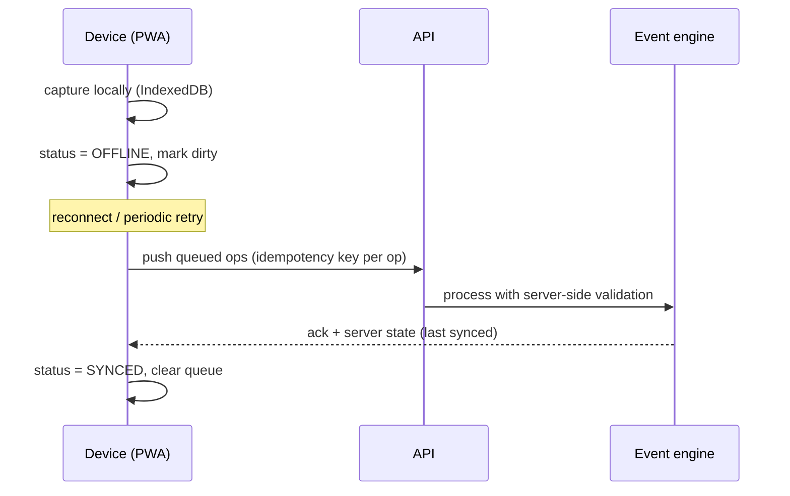

# Offline / Low-Connectivity Architecture
## Architecture package — item 18

> Master document: [`architecture.md`](architecture.md). Farm sites may have intermittent
> connectivity (§43). **We do not claim offline support unless it actually works** (§43, §75).

---

## 1. Scope & priorities

Offline capture is prioritised for the field activities that happen away from the office:

| Priority | Capability | Notes |
| --- | --- | --- |
| 1 | Attendance | one-tap check-in/out |
| 2 | Livestock checks | daily checklist + counts + photo |
| 3 | Stock counts | count entry per item |
| 4 | Farm activities | start/complete crop & livestock tasks |
| 5 | Inspections | checklist + photo evidence |
| 6 | Basic task updates | start/submit assigned tasks |

Complex, multi-record, or financial flows remain **online-only** (they require immediate validation
and authority checks): rent payments, approvals, lease signing, procurement approvals.

---

## 2. Model: Capture → Queue → Sync

### 2.1 Principles

- **Local-first capture:** the device PWA stores pending operations in local storage (IndexedDB) and
  replays them in order when connectivity returns.
- **Idempotency keys:** each queued operation carries a client-generated key so retries never
  duplicate a record.
- **Server-side validation:** replay is subject to the same validation/workflow/permission rules as
  online calls — offline never bypasses the domain model.
- **Visible sync state** (§61): the UI always shows `ONLINE · OFFLINE · SYNCING · SYNCED · SYNC
  ERROR`; it never pretends a record synced when it has not.
- **Conflict handling:** last-write-wins by default for simple field capture; count/checklist
  submissions are immutable new records (no update conflicts); genuine conflicts surface for the
  officer to resolve — never silently discarded.

### 2.2 Conflict resolution tiers

| Situation | Resolution |
| --- | --- |
| New records (attendance, counts, checklists) | append-only → no conflict, just ordering |
| Edits to a task status | server validates transition; rejects invalid transitions with reason |
| Concurrent edits to same field | last-write-wins + audit trail (both versions recorded) |
| Genuine domain conflict (e.g. count vs receipt) | flag for officer review |

---

## 3. Technical approach

- **PWA** (installable, offline-capable service worker) for field workers — the same design system as
  the admin UI but a radically simplified surface (§61).
- **Sync service** on the backend: an endpoint `POST /api/sync/batch` accepts ordered operation
  lists, processes transactionally where safe, and returns per-op results.
- **Backoff & retry:** exponential backoff with jitter; queue depth and failed syncs are visible in
  System Health (§55) — never hidden.
- **TLS + token auth** on sync endpoints; ops are scoped to the worker's own permitted actions.

---

## 4. Acceptance tests (offline)

1. Capture attendance with no connectivity → device shows OFFLINE; record queued.
2. Reconnect → queue replays → device shows SYNCED; server shows exactly one record (no duplicates).
3. Replay an operation the server rejects → device shows SYNC ERROR with the server's reason; nothing
   partially applied.
4. Two devices submit counts for the same item → both persist as distinct COUNT events; variance
   computed on the ledger, not overwritten.

---

*Next in package: [`testing-strategy.md`](testing-strategy.md).*
