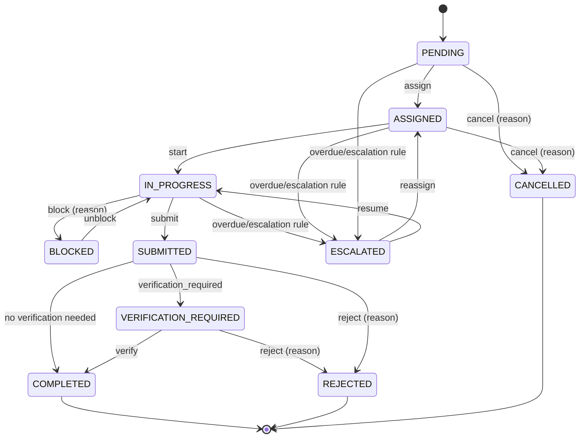
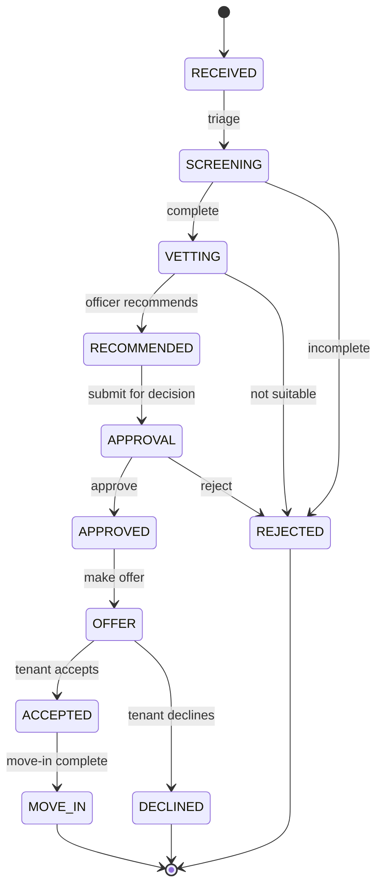
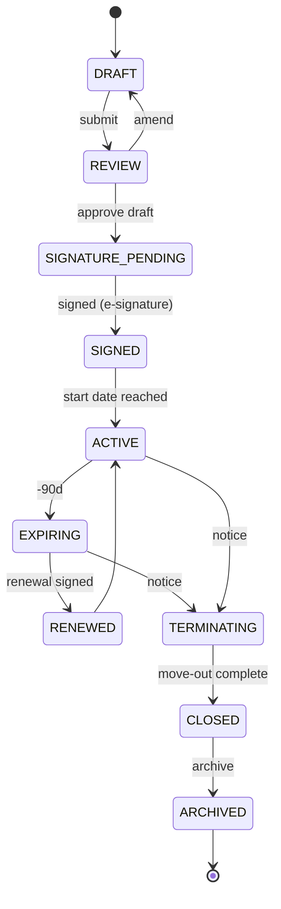
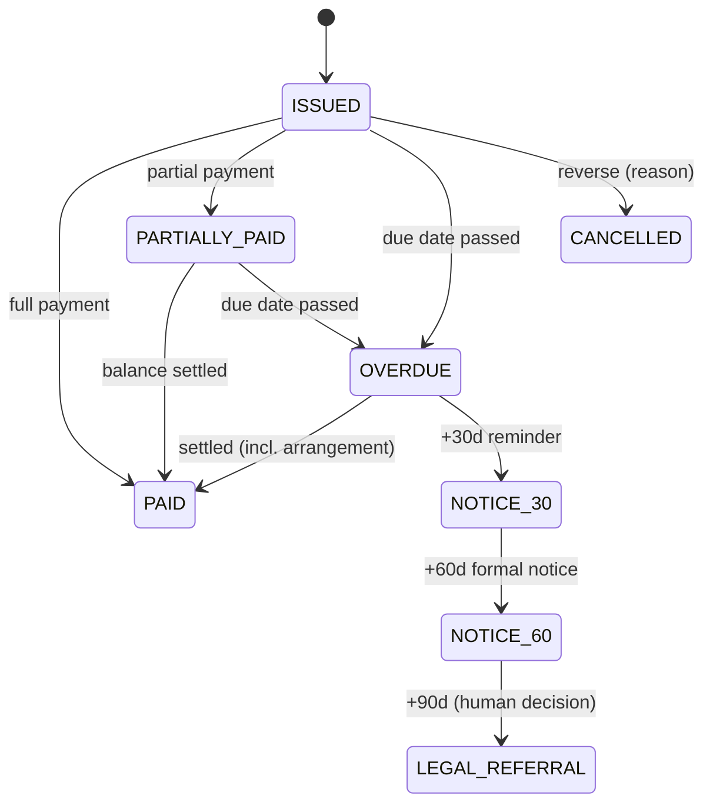
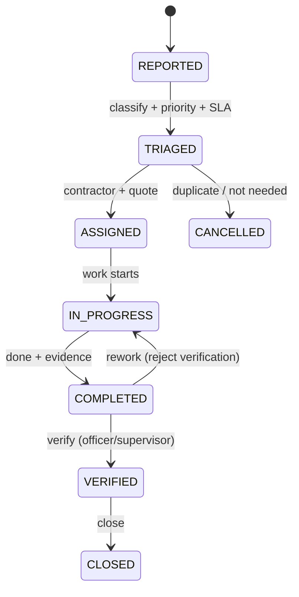
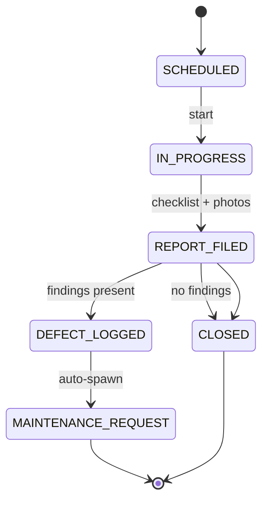
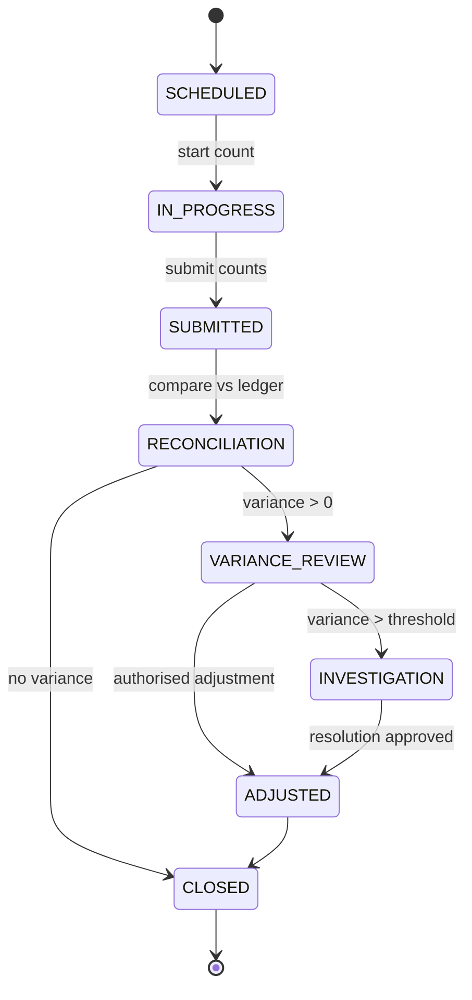
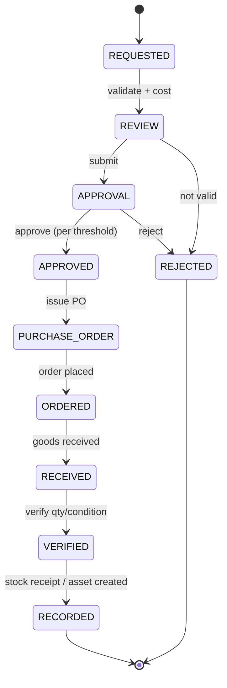
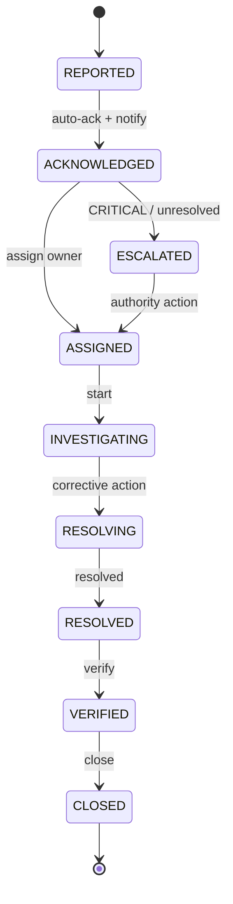
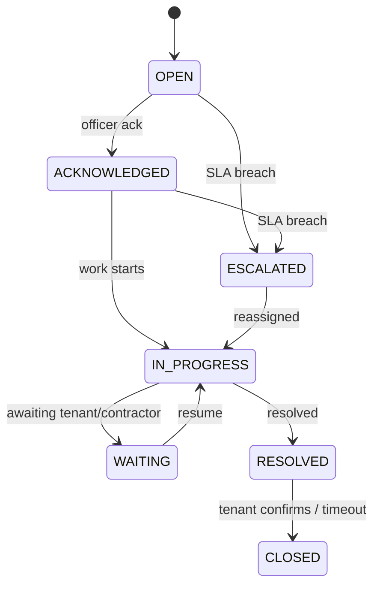

# Workflow & State-Machine Definitions
## Architecture package — item 7

> Master document: [`architecture.md`](architecture.md). Every transition carries: **actor**,
> **condition**, **required evidence**, **approval requirement**, **notifications**, and an
> **audit event**. Workflows are enforced server-side (§9) — the UI cannot jump states.

---

## 1. Task lifecycle (Task Engine)



| Transition | Actor | Condition | Evidence | Notifications | Audit |
| --- | --- | --- | --- | --- | --- |
| assign | officer/supervisor | PENDING | — | assignee | yes |
| start | assignee | ASSIGNED | — | owner | yes |
| block/unblock | assignee | IN_PROGRESS | reason | owner | yes |
| submit | assignee | IN_PROGRESS | required if `evidence_required` | verifier | yes |
| verify | verifier | VERIFICATION_REQUIRED | verifier sign-off | owner | yes |
| reject | verifier | SUBMITTED/VERIFICATION_REQUIRED | reason | assignee | yes |
| complete | system/verifier | SUBMITTED (no verification) | — | owner | yes |
| escalate | rules engine | overdue/SLA breach | — | ladder (§11) | yes |
| cancel | officer | any active | reason | owner | yes |

> Transition rules come from [`automation-engines.md`](automation-engines.md) §1.

---

## 2. Tenant application (§15)



- **Approval is human** (§53): `RECOMMENDED → APPROVAL` requires HoSS/officer per config; never automatic.
- **Evidence:** application documents at RECEIVED; vetting checklist at VETTING; decision note at APPROVAL; signed lease at MOVE_IN.

## 3. Lease lifecycle (§17)



- Renewal alerts at **−90 / −60 / −30 days**; **never auto-renew** (§17).
- Evidence: signed document (SIGNED), move-out inspection (CLOSED).

## 4. Rent invoice & arrears (§18–19)



- **Arrears engine** computes outstanding, days overdue, and aging bucket
  (`CURRENT, 1–30, 31–60, 61–90, 90+`) live from the ledger.
- **Legal referral is a human decision** — the system prepares the notice, never sends legal action
  itself (§19, §53).
- Payments are append-only; corrections are reversal/adjustment entries (§38).

## 5. Maintenance (§20)



- Source may be a **ticket**, an **inspection defect**, or direct report (§52).

## 6. Inspection → defect chain (§21)



## 7. Stock count & variance (§26)



- **Never silently alter balances** (§26): adjustments require approval; variances above threshold
  spawn an investigation task.

## 8. Procurement (§28)



- Approval authority is **configurable** — `DECISION_REQUIRED: procurement approval thresholds`
  ([`assumptions.md`](assumptions.md)). Never auto-approve purchases (§28, §53).

## 9. Incident management (§29)



- Severity `LOW/MEDIUM/HIGH/CRITICAL`; **CRITICAL triggers immediate notification** to officer + HoSS
  (§29). Incidents never enter normal task queues silently.

## 10. Tenant service desk (§30)



## 11. Workflow engine contract (§9)

Every workflow definition is data (configurable), not code:

```text
WORKFLOW = {
  entity, states[], transitions[],
  transition = { from, to, actor_role, condition, evidence_required, approval_required,
                 notify[], audit_event }
}
```

- Enforced by a single reusable **state-machine validator** used by all domains.
- Any invalid transition returns a domain error ("cannot transition IN_PROGRESS → CLOSED") and is
  logged — never silently ignored.

---

*Next in package: [`event-catalogue.md`](event-catalogue.md).*
